# Індекс зрілості Industrie 4.0

Оригінальна назва: **Industrie 4.0 Maturity Index.** 

Managing the Digital Transformation of Companies, acatech STUDIE, Update 2020, Günther Schuh, Reiner Anderl, Roman Dumitrescu, Antonio Krüger, Michael ten Hompel (Eds.)

У даному посібнику наводиться оброблений та переформатований переклад висвітлених результатів дослідження, який проводила і опублікувала Німецька національна академія науки та інженерії (acatech, https://en.acatech.de/). Повна англомовна версія посібника доступна за [цим посиланням](https://en.acatech.de/publication/industrie-4-0-maturity-index-update-2020/). Я не маю права викладати повний переклад даного звіту (принаймні зараз), так як документ захищений авторським правом Тому тут описаний скорочений переклад. Обговорення даного звіту та все що зв'язано з індексом зрілості можна робити в [даній темі](https://github.com/pupenasan/dt/issues/4) на Гітхаб. Також якщо Ви хочете приєднатися до спільноти розробників, дослідників та користувачів цифрових двійників в Україні, можете подивитися на [даний репозиторій](https://github.com/pupenasan/dt) . 

**На даний момент це чорнова версія, потребує вичитування та редагування! Буду радий будь якій допомозі**

## Про дослідження

Передумовою дослідження стала велика кількість невдалих проектів по цифровій трансформації підприємств. Великий конкурентний тиск спонукав до спроб реалізації в Німеччині та Європі проектів пов’язаних з Industrie 4.0, однак значна частина цих проектів зазнала краху. Це пов'язано з тим, що проекти недостатньо суттєво сприяли досягненню корпоративних цілей, натомість занадто сильно були зосереджені на окремих технологіях, або не могли бути розширені. Це спонукало  до проведення системного дослідження та формування рекомендацій щодо визначення плинного стану підприємства щодо його індексу зрілості Індустрії 4.0 та руху до підвищення цього індексу, та вдалого впровадження пілотних проектів що цьому спонукають. Перший варіант звіту був опублікований у 2017 році, у даній оновленій версії 2020-го дослідники переглянули вихідні рекомендації щодо успішної цифрової трансформації виробничих компаній, торкаючись як їх бізнес-стратегії, так і чотирьох структурних областей: ресурсів, інформаційних систем, культури та організаційної структури. Конкретні приклади компаній, які успішно впровадили цей підхід і досягли позитивного впливу на свою ефективність, наведено в іншій супутній публікації від acatech «Використання індексу зрілості промисловості 4.0 – поточні виклики, приклади та тенденції» ([Industrie 4.0 Maturity Index in Industry – current challenges, case studies and trends](https://en.acatech.de/publication/using-the-industrie-4-0-maturity-index-in-industry-case-studies/). ).

Індустрія 4.0 - це інтеграція інформаційних та комунікаційних технологій у промислове виробництво, що дозволяє підвищити ефективність процесів, процедур і систем та створити нові можливості для диференціації продуктів та послуг компаній. Проте, ***для використання всього потенціалу новітніх технологій недостатньо їх технічного впровадження, необхідна організаційна трансформація та культурна адаптація компаній***.  Кінцева мета — стати гнучкою компанією, що навчається, яка здатна постійно й динамічно адаптуватися до руйнівного середовища, зокрема, щоб краще долати несподівані події, такі як, наприклад криза, пов’язана з коронавірусом. 

Для цифрової трансформації підприємства перш за все вони мають визначити свій поточний стан, після чого сформувати стратегії щодо поетапного переходу в кінцевий стан, з чіткою фіксацією очікуваних результатів на кожному етапі. Для формалізації станів компанії в термінах цифрової трансформації  дослідники acatech розробили показник Індекс зрілості Індустрії 4.0 (Industrie 4.0 Maturity Index). Цей індекс зрілості використовується як модель для визначення як плинного стану так і очікуваних на всіх етапах трансформації. Індекс має шість ступенів в в 4-х ключових сферах: ресурсів, інформаційних систем, організаційної структури та культури. Кожна сфера пов’язана з двома фундаментальними принципами. Посібник описує як визначити індекс зрілості в контексті кожної зі сфер і допомагає в побудові дорожнього кати цифрової трансформації, яка будується для кожного підприємства окремо.

## Вступ

Потенціал створення вартості Industrie 4.0 для промисловості Німеччини оцінюється в 70-140 мільярдів євро лише на період до 2025 року. Однією з головних причин недовикористання потенціалу є в тому, що зараз багато компаній особливо МСП (малі та середні підприємства) не розуміють конкретних переваг Industrie 4.0, тому і не інвестують в свою цифрову трансформацію. Наразі єдині заходи, які впроваджуються в багатьох компаніях, включають випадкові пілотні проекти, які не можуть продемонструвати весь потенціал Індустрії 4.0, оскільки вони е враховують ключові аспекти її впровадження, такі як організаційна структура та культура компанії. 

У той же час, динамічне середовище та пов’язана з цим складність означають, що підприємства повинні приймати швидше та кращі рішення, якщо вони хочуть залишатися конкурентоспроможними в довгостроковій перспективі. Сучасна бізнес-практика часто не справляється з цим викликом і ризикує втратити керовану точку свого основного бізнесу. Процес прийняття рішень може тривати тижні або навіть місяці, і рішення часто базуються на інтуїтивному відчутті, а не на надійних даних. Процеси розроблення продукту випускають документи з вимогами до продукту та встановлюють детальні специфікації продукту без повного розуміння потреб клієнта. Коли розробники дізнаються щось нове, можна внести лише обмежені зміни в процес розроблення або виробництва, але навіть це може зайняти багато часу. Багатьом співробітникам і особам, які приймають рішення, регулярно доводиться витрачати час на пошук і очікування потрібної інформації. Це лише кілька прикладів, щоб проілюструвати основні недоліки, які існують на даний момент, і потенціал для далекосяжних перетворень.   

Головний економічний потенціал Індустрії 4.0 полягає в її здатності прискорювати корпоративні процеси прийняття рішень і адаптації. Це стосується як процесів підвищення ефективності проектування, виробництва, послуг, продажів і маркетингу, так і цілих бізнес-підрозділів або змін у бізнес-моделі. У цьому дослідженні Industrie 4.0 означується як «обмін великим обсягом даних в режимі реального часу, багатосторонню комунікацію і взаємопов'язаність між кіберфізичними системами та людьми». Наявність величезної кількості даних та інформації за доступними цінами та, якщо необхідно, у режимі реального часу дозволяє краще зрозуміти, як речі пов’язані між собою. Це створює основу для швидшого процесу прийняття рішень. У поєднанні з правильною організаційною структурою це дозволяє компаніям швидше реагувати на дедалі динамічніші ринки своїх клієнтів, швидше розробляти нові продукти, які точніше відповідають вимогам клієнтів і швидше виводити ці продукти на ринок. ***Взаємозв’язок технологічних і, зокрема, організаційних компонентів дає змогу досягти гнучкості, яка є ключовою здатністю, необхідною компаніям в Індустрії 4.0. Це перетворення на гнучку компанію є найважливішою можливістю для виробничих компаній в Industrie 4.0. Звичайно, компанії зможуть використовувати весь потенціал Індустрії 4.0, лише якщо вони запровадять описані вище практики в усіх своїх бізнес-процесах і якщо дані й аналіз даних будуть видимі для всього підприємства.*** 

Гнучкість є стратегічною характеристикою, яка стає все більш важливою для успішних компаній. У цьому контексті гнучкість означає здатність впроваджувати зміни в компанії в режимі реального часу, включаючи, наприклад, фундаментальні системні зміни в бізнес-моделі компанії. Отже, значення Індустрії 4.0 полягає в ключовій ролі обробки інформації у забезпеченні швидких організаційних процесів адаптації. Чим швидше організація може адаптуватися до події, яка викликає зміну її обставин, тим більші переваги приносить адаптація. У цьому контексті загальний термін «подія» може стосуватися низки різних бізнес-рішень. Події можуть мати короткостроковий характер, наприклад, поломка виробничої лінії, або середньострокові та довготермінові, наприклад, зміна вимог до продукту та пов’язані з цим модифікації самого дизайну продукту, виробничого процесу та пов’язаних процесів у закупівлях, якості і сервісі.

У теперішній час між виникненням та отриманням інформації про подію виникає затримка. Це у свою чергу приводить до затримки у прийнятті відповідних рішень та (контр)заходів (див. рис. 1). Одна з причин цього  в тому, що відповідні інформаційні системи недостатньо інтегровані, щоб забезпечити наскрізну обробку даних, від збору даних до аналізу.

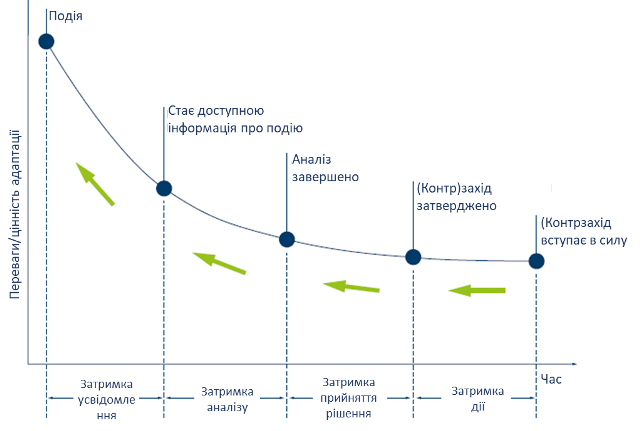

Рисунок 1. Корпоративні процеси адаптації

Можливості Industrie 4.0 допомагають виробничим компаніям значно скоротити час між виникненням події та впровадженням відповідної реакції. На практиці це означає, що, наприклад, зміни у вимогах клієнтів на основі польових даних можуть бути включені навіть під час виробничого процесу продукту, оскільки компанія володіє гнучкістю, щоб адаптуватися до нової ситуації. Як наслідок, клієнт може отримати продукт, який відповідає його вимогам, у значно коротший період часу та вищої якості.

Метою трансформації є створення гнучкої компанії, що навчається, здатної постійно адаптуватися до мінливих умов завдяки використанню відповідних технологій, організаційного навчання та процесів прийняття рішень, які використовують переваги високої якості даних, які доступні швидше. Гнучка компанія, що навчається, здатна займати цифрові керовані точки. Індекс зрілості acatech Industrie 4.0 Maturity Index надає компаніям-виробникам вказівки щодо того, як прокласти власний індивідуальний шлях до того, щоб стати гнучкою компанією, яка навчається, і які заходи принесуть конкретні переваги.

## Методологія впровадження Industrie 4.0 від acatech 

Шлях до Industrie 4.0 буде різним для кожної компанії. Дослідження acatech пропонує конкретну методологію для здійснення такого переходу.   

**Вхід - визначення цілей**

Спочатку треба зробити аналіз поточної ситуації та цілі компанії. Важливо визначити якими є стратегічні цілі компанії на наступні кілька років:

- у яких сферах і в якому обсязі вона має намір збільшити цінність за допомогою Industrie 4.0. Наприклад, підвищення продуктивності заводу може бути досягнуто за рахунок збільшення обсягу виробництва або зниження витрат на виробництво, тоді як цілі сталого розвитку можна досягти за допомогою заходів з енергоефективності, а цілі підвищення гнучкості логістики за рахунок скорочення часу виконання робіт. 
- ступінь, у якому вона сподівається це зробити і показники, які можна використовувати для вимірювання результатів. 

Після цього необхідно визначити як можна виміряти поточне впровадження Industrie 4.0 всередині компанії згідно означених показників у відповідній частині, та в якому стані ці показники зараз: які технології та системи вже впроваджено та як вони працюють у компанії.  

**Методологічний аналіз**

На основі результатів наступним кроком є ідентифікація потрібних компанії здібностей (capabilities) для успішної реалізації Industrie 4.0. Для порівняння поточних здібностей що є у компанії Industrie 4.0 з тим, що їй потрібно для досягнення своїх стратегічних цілей використовується аналіз відхилень (gap analysis). Заходи, необхідні для отримання відсутніх здібностей, можна потім об’єднати в план цифрової трансформації. Важливо визнати, що успішні перетворення відбуваються поетапно. Крім того, кожна компанія повинна прийняти стратегічне рішення щодо конкретних переваг, які вона хоче отримати. 

**Вихід - дорожня карта**

Результатом цієї методології є формування дорожньої карти цифрової трансформації для всіх відповідних сфер із покроковим підходом до досягнення переваг, який зменшує інвестиційні ризики для компанії. Дорожня карта допомагає компаніям зрозуміти важливість розробки спільної цифрової стратегії для всього бізнесу та забезпечує основу для поетапного впровадження Industrie 4.0. 

## Індекс зрілості Industrie 4.0 від acatech 

Сьогодні компанії все ще стикаються з проблемою створення базових умов для Industrie 4.0. **Індекс зрілості Індустрії 4.0** (Industrie 4.0 Maturity Index, надалі по тексту "Індекс зрілості") від acatech оцінює виробничі компанії з технологічної, організаційної та культурної точки зору, зосереджуючись при цьому на їх бізнес-процесах. Це якраз є тим показником, який можна використовувати в методологічному аналізі та виробленні та реалізації дорожніх карт. 

Індекс зрілості базується на моделі, що показує послідовності етапів зрілості, тобто рівнях розвитку, заснованих на цінностях, які допомагають компаніям пройти кожен етап трансформації, від базових вимог для Industrie 4.0 до повного впровадження (рис.2). 

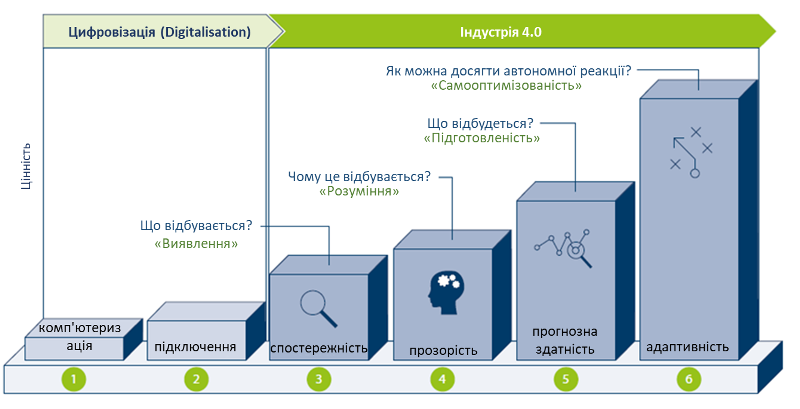

Рисунок 2. Етапи шляху розвитку Industry 4.0

Відповідно, шлях розвитку починається з цифровізації. Хоча цифровізація сама по собі не є частиною Industrie 4.0, комп’ютеризація (Computerisation) та ступінь підключеності(Connectivity) є основними вимогами для її реалізації. За цими двома початковими етапами слідують ще чотири етапи, на яких розробляються можливості, необхідні для Industrie 4.0.

Індекс зрілості базується на представленні внутрішніх аспектів керування з концепції «Каркасу (фреймворку) виробництва та керування» (Production and Management Framework), які будуть описані нижче. У цьому каркасі кожна компанія характеризується через корпоративну структуру, корпоративні процеси та корпоративний розвиток (рис.3). 

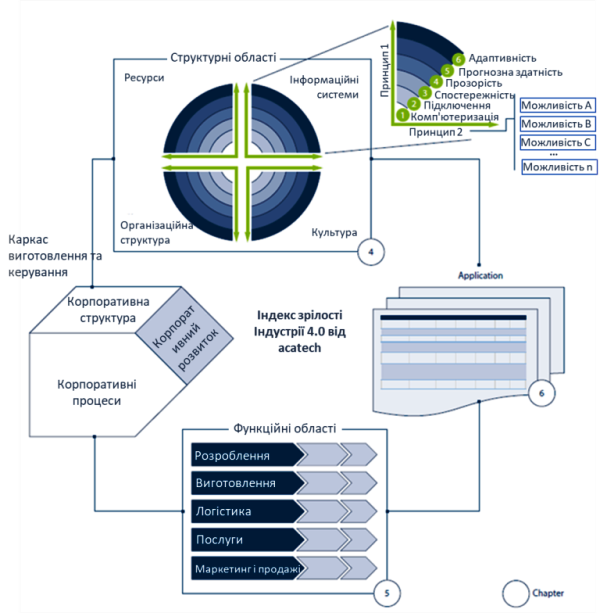

Рисунок 3. Індекс зрілості в контексті концепції «Фреймворку виробництва та керування»

## Можливості в структурних областях

Індекс зрілості оцінює рівень корпоративної структури, який в цій моделі представлений через чотири структурні області: ресурси, інформаційні системи, культура та організаційна структура. Разом ці структурні області складають структуру організації. Вони з’єднані шістьма етапами шляху розвитку Industrie 4.0, які зображені у вигляді шести концентричних кіл. Кожна структурна область має два принципи, що проходять через неї, які служать керівництвом для її подальшого розвитку. Кожен принцип містить ряд можливостей, які необхідно послідовно розвивати для кожного етапу розвитку цінностей. Ступінь реалізації цих можливостей визначає стадію зрілості відповідного принципу. Етапи зрілості обох принципів поєднуються, щоб забезпечити загальну оцінку поточного етапу розвитку структурної області. На рис. 4 оцінки структурних областей зображені чотирма зеленими крапками.

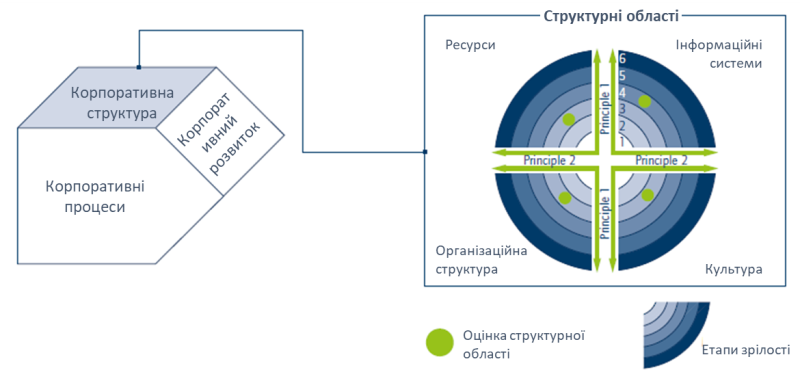

Рисунок 4. Структурні області компанії

Нижче описано можливості, якими повинна володіти виробнича компанія, щоб перетворитися на гнучку організацію, яка навчається. Вони розглядаються в контексті чотирьох структурних областей: ресурсів, інформаційних систем, культури та організаційної структури. 

### Ресурси

Під ресурсами розуміються матеріальні та фізичні активи, такі як робоча сила (людські ресурси), машини та обладнання, інструменти, матеріали та кінцевий продукт. Робітники повинні володіти певними навичками, щоб максимально використовувати отриману інформацію, а правильно налаштовані технічні ресурси можуть допомогти зменшити затримку даних і дій. На додаток до виконання своїх конкретних функцій, компанії повинні намагатися забезпечити, щоб їхні ресурси мали інтерфейс між фізичним і цифровим світами. Тому при оцінці зрілості даної структурної області враховують два принципи (рис.5):

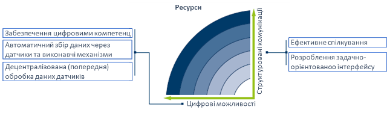

Рисунок 5. Можливості структурної області «ресурси»

- **Цифрові можливості.** Ресурси повинні володіти необхідними можливостями для роботи на основі інформації. Щоб генерувати та аналізувати дані та впроваджувати відповідні рішення, наявні ресурси – тобто робітники, машини та обладнання, інструменти, матеріали та продукти – повинні набути певних компетенцій або бути модернізовані відповідними технологічними компонентами. Ці базові вимоги до роботи та навчання на основі інформації в моделі називаються «цифровими можливостями».
  - Забезпечення цифровими компетентностями. Щоб генерувати та аналізувати дані та впроваджувати відповідні рішення, наявні ресурси – тобто весь персонал, машини та обладнання, інструменти, матеріали та продукти – повинні набути певних компетенцій або бути модернізовані відповідними технологічними компонентами. Персонал повинен мати відповідні IT навички, загальне розуміння технологій Індустрії 4.0, розуміння важливості конфіденційності інформації та кібербезпеки. 
  - Автоматичний збір даних через датчики. Для технічних ресурсів необхідно забезпечити збір даних і перетворення цих даних в інформацію, тобто підготовлених для підтримки прийняття рішень. Пріоритетним є їх розвиток для створення кіберфізичних систем (CPS, cyber-physical systems). У багатьох засобах вже є датчики в складі систем керування та контролю. У додаток до цього для кращої ідентифікації ресурсів можна використовувати RFID, засоби визначення геолокації та інші додаткові датчики.  
  - Децентралізована обробка даних. У багатьох технічних засобах є вбудовані системи керування, які є також ключовими компонентами кіберфізичних систем. Вони утворюють зв’язок між рівнем зв’язку та електромеханічними компонентами (приводами). Збільшення їх обчислювальної потужності дозволяє децентралізувати попередню обробку та виконувати її безпосередньо у вбудованих системах, пов’язаних із технічними ресурсами. Зменшення затримки розповсюдження сигналу означає, що критичні за часом обчислення можна виконувати швидше, створюючи нові програми, наприклад, у сфері людино-машинного інтерфейсу. 
- **Структуровані комунікації.** Чітка загальна картина виникає лише після об’єднання різних фрагментів інформації, тому слід передавати дані та, якщо можливо, генерувати їх у максимально структурований спосіб. Для цього потрібні відповідні інтерфейси, а також консенсус щодо мети спілкування. Відповідно, принцип структурованої комунікації описує технічний підхід до комунікаційних засобів для працівників та інтерфейсів між людьми та машинами та між різними машинами.
  - Ефективне спілкування між співробітниками. Комунікація між співробітниками завжди повинна бути задокументована з можливістю відстеження, без надмірної деталізації і забезпечуватися таким чином, щоб відповідати потребам відповідних груп зацікавлених сторін. Зараз співробітники можуть витрачати багато часу на пошук і очікування інформації. Простежувана комунікація означає, що контекст повідомлення відомий завдяки автоматичному додаванню тегів, або доступ до нього можна отримати в режимі реального часу шляхом інтеграції з відповідною системою бізнес-застосунків. Запобігти надмірності можна за допомогою централізованого зберігання даних, лише однієї дійсної версії файлу (єдине джерело правди), якому надається дозвіл доступу замість відправки копії. Крім того, профілі ролей і облікові дані дають змогу додавати співробітників до процесу спілкування контекстно. Подібні вимоги застосовуються також до процедур затвердження, наприклад через запровадження цифрових підписів.
  - Розроблення задачно-орієнтованого інтерфейсу. Тут варто виділити кілька сторін взамєодії.
    - Людино-машинний інтерфейс. Тут важливі технології ідентифікації та візуалізації. Через зростаючу складність процесів і збільшення кола завдань, які повинні виконувати співробітники  є важливими контекстно-залежні засоби допомоги, які можуть бути реалізовані через засоби автоідентифікації (автоматичне розпізнання об’єктів та їх атрибутів) та відповідні графічні інтерфейси. 
    - Машино-машинний інтерфейс. Апаратні інтерфейси відіграють ключову роль у забезпеченні взаємодії різних типів технологічних ресурсів один з одним. Технології ідентифікації уможливлюють (взаємне) розпізнавання технологічних ресурсів і людей, а також узгодження конкретних інформаційних вимог. 
    - Інтерфейс з матеріалами. Те саме стосується матеріалів – якщо є достатня кількість точок звітності, можна відслідковувати та відстежувати товари, якщо їх можна автоматично ідентифікувати або за допомогою носія, або за допомогою ідентифікаторів (RFID, QR-код, тощо) на самих товарах. У поєднанні з системною інтеграцією це дає змогу задовольнити зростаючі вимоги клієнтів щодо відстеження продукції. 

Рис.6 показує характеристики, якими повинні володіти ресурси виробничої компанії після того, як вона досягла стадії зрілості «адаптивності». 

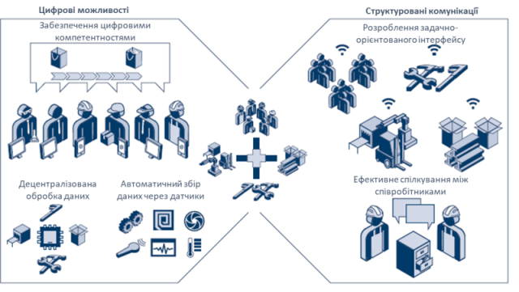

Рисунок 6. Можливості, необхідні в структурній області «ресурси» 

### Інформаційні системи

Інформаційні системи — це соціально-технічні системи, в яких інформація надається на основі економічних критеріїв як людьми, так і інформаційно-комунікаційними технологіями. У рамках даного дослідження під поняттям "ІТ-система" розуміється інше - це окремі прикладні системи (наприклад, системи ERP), тому це не є синоніми. Конфігурація інформаційних систем компанії є ключовою для того, щоб доступні дані та інформація могли використовуватися для прийняття рішень. Прогрес, досягнутий у цифровізації бізнесу, означає, що компаніям-виробникам стає все простіше й легше приймати ці рішення на основі даних у режимі реального часу. Тому при оцінці зрілості даної структурної області враховують два принципи (рис.7):

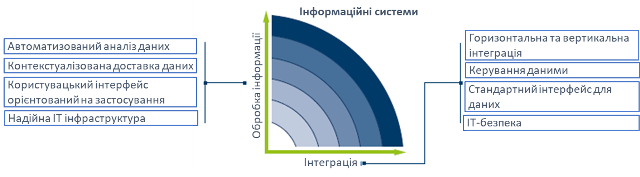

Рисунок 7: Можливості структурної області «інформаційні системи» 

- **Самонавчальна обробка інформації**. Дані повинні бути підготовлені та оброблені таким чином, щоб підтримувати прийняття рішень. Для того, щоб дані можна було використовувати, організація повинна відповідати технічним вимогам для доступу в режимі реального часу та мати інфраструктуру, яка забезпечує необхідну обробку даних і безперебійну доставку інформації а також представлення її у зручній для користувача формі. У цьому контексті самонавчання означає використання інформаційними системами нових технологічних рішень, здатних ідентифікувати причинно-наслідкові зв’язки з метою постійного вдосконалення своїх обчислювальних процесів. Це можливо завдяки таким технологіям, як штучний інтелект і машинне навчання.
  - Автоматизований аналіз даних. Прийняття рішень на основі даних можливе завдяки автоматизованому аналізу даних, який постійно агрегує дані для отримання інформації, витягує знання з цієї інформації та надає її користувачам для підтримки своїх рішень. Це можливо зробити за допомогою визначення причинно-наслідкових зв’язків і прогнозування майбутніх подій використовуючи, наприклад, моделювання або регресії. Це стосується як окремих машин так і на загальному рівні виробництва. У випадку виробництва аналіз передбачає обробку та кореляцію дуже великих і часто різнорідних наборів даних. 
  - Контекстуалізована доставка даних (інформації). Це означає, що замість того, щоб користувач шукав інформацію в кількох різних ІТ-системах і обробляв, сортував чи інтерпретував її самостійно, інформація готується та доставляється відповідно до вимог конкретного контексту (принцип надсилання). Співробітники отримують інформацію за допомогою ефективної та дієвої інформаційної логістики, яка доставляє правильну інформацію в потрібне місце, у потрібний час, належної якості, потрібній людині та в потрібній кількості. Наприклад, можна забезпечити зрозумілу візуалізацію складних операцій складання за допомогою контекстної 3D-анімації, або надання відділу виробничого контролю запланованих дат виконання замовлення, або технічним працівникам докладної інформації про причину поломки разом із додатковою детальною інформацією.  
  - Користувацький інтерфейс орієнтований на застосування (application)/завдання(task). Надана інформація повинна постійно узгоджуватися з потребами одержувача, а її формат повинен бути адаптований до поточного використання. Його зміст і подання повинні бути адаптовані до завдання, яке виконується, і рівня кваліфікації працівника. Залежно від програми, інтерфейс користувача може, наприклад, надавати дані у формі таблиць, анімації, доповненої реальності або мови (усних інструкцій, які допоможуть їм виконати процес). Залежно від завдання можна використовувати управління жестами або голосом. 
  - Надійна/стійка ІТ-інфраструктура. Аналіз і доставка даних покладаються на стійку ІТ-інфраструктуру, яка відповідає відповідним технічним вимогам щодо збору, передачі, зберігання та обробки даних і гарантує функціональність ІТ-систем. Це вимагає постійної адаптації технічної продуктивності ІТ-інфраструктури до поточних вимог, що забезпечується резервним зберіганням даних або дизайном системи. Залежно від конструкції, ці резервування можуть бути реалізовані всередині або в хмарі. Резервне копіювання або спеціалізоване програмне забезпечення запобігає загрозам для людей і матеріальних активів і гарантує тривалу придатність системи. 
- **Інтеграція інформаційних систем**. Системи повинні бути інтегровані, щоб уможливити використання спільних даних у всьому ланцюжку створення вартості. Для цього необхідно створити архітектуру інформаційної системи, яка з’єднує існуючі ІТ-системи між собою та з ресурсами. Замість того, щоб дані дублювалися в різних ІТ-системах, усі вони містяться в єдиній первинній інформаційній системі (єдине джерело правди), що гарантує, що всі використовують однакові дані.  Створення платформи, що об’єднує різні інформаційні системи, потребує стандартних інтерфейсів, гнучкості, відкритості, комплексної ІТ-безпеки та належної якості даних.  
  - Горизонтальна та вертикальна інтеграція. Використання загальних даних у всьому ланцюжку створення вартості можливе завдяки інформаційним системам, які повністю інтегровані як вертикально, так і горизонтально. Між усіма ІТ-системами в ланцюжку створення вартості безперервно обмінюються інформацією, щоб інформація про замовлення завжди була пов’язана з продуктом, інструкціями щодо роботи та процесу та інформацією про клієнта, а всі користувачі мали доступ до одного набору даних. Це означає відхід від статус-кво надто складних архітектур із резервним зберіганням даних. Основна ІТ-система, що містить інформацію про замовлення, пов’язана з усім, від систем виробництва та планування до рівня машини та поля. Після завершення роботи машини автоматично надсилають звіт про стан замовлення. Це створює «єдине джерело правди» – інформація зберігається лише в одній первинній логічній інформаційній системі, до якої мають доступ усі користувачі в ланцюжку створення вартості та системі записів. Сьогодні дані про продукт і дизайн часто знаходяться в системі PLM, тоді як дані про замовлення зберігаються в системі ERP, а пов’язані дані про клієнта знаходяться в системі CRM. Відсутність інтеграції метаданих означає, що функції розробки, виробництва та маркетингу мають власні, окремі набори даних, які не розподіляються ефективно між пов’язаними операційними програмами та інструментами підтримки прийняття рішень. У результаті зміни в одній із цих функцій не поширюються на інші. Таким чином, гнучким компаніям потрібна логічна або фізична платформа, яка інтегрує та надає користувачам інформацію, необхідну для операцій і прийняття рішень, і забезпечує доступ до даних та інформації. Також важливо забезпечити прозорість щодо використовуваних ІТ-систем – різним відділам не можна дозволяти використовувати власні "тіньові" ІТ-системи, які не контролюються ІТ-відділом.
  - Керування даними (очищення та стандартизація). Окрім інтерфейсів даних, інтеграція ІТ-систем також залежить від достатньо високої якості даних. Низька якість даних в ІТ-системах призводить до неправильних агрегованих даних і неточного зворотного зв’язку, що зрештою підриває довіру як до ІТ-систем, так і до їх вмісту. Це унеможливлює досягнення мети прийняття рішень на основі даних. Тому компанії повинні придбати відповідні технічні та, зокрема, організаційні можливості, щоб покращити якість даних. Політика управління даними надає організаціям рекомендації щодо обробки, зберігання, управління та представлення високоякісних даних у компанії. Технічні можливості для покращення якості даних включають автоматизоване очищення даних (ідентифікація, стандартизація, видалення дублікатів, консолідація та покращення даних) і системи керування основними даними.
  - Стандартний інтерфейс для даних. Замість того, щоб вимагати централізованого зберігання всіх даних, ключем до створення єдиного джерела правди є з’єднання всіх ІТ-систем одна з одною через стандартні інтерфейси даних. API, мікросервіси та інтерфейси даних сприяють обміну даними та інформацією з окремих ІТ-систем і, отже, повинні вибиратися на основі необхідного потоку інформації. Щоб завжди забезпечити гнучкий інформаційний потік і перехід обміну даними під час переходу від однієї інформаційної системи до іншої, необхідно впровадити нейтральні або стандартні інтерфейси та формати обміну даними в усіх відповідних системах. Вони повинні використовувати відкритий стандарт що є універсальним для відповідної категорії застосування. Одним із прикладів стандартного інтерфейсу, який особливо популярний у сфері Industrie 4.0, є архітектура OPC-UA для інтерфейсів машина-машина.
  - ІТ-безпека. Посилення інтеграції інформаційних систем, а також людського фактору та інших факторів супроводжується ризиком злочинних атак. Потенційна шкода, яку можуть завдати ці атаки, зростає пропорційно до ступеня інтеграції. ІТ-безпека охоплює різні стратегії визначення та впровадження заходів безпеки. Відповідність таким стандартам, як IEC 62443, може допомогти стримати ризики. Такі стандарти включають проактивні заходи для підтримки ІТ-безпеки та її адаптації до мінливих обставин. Заходи стосуються питань адміністрування активів, ідентифікації та автентифікації користувачів, перевірки справності системи та контролю потоку даних. Реагування на існуючі інциденти безпеки ІТ також охоплюються стандартами безпеки ІТ.

Рис.8 показує характеристики, якими повинні володіти ресурси виробничої компанії після того, як вона досягла стадії зрілості «адаптивності». 

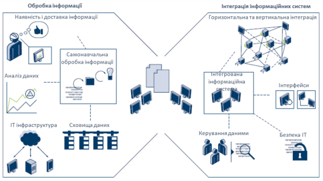

Рисунок 8: Можливості, необхідні в структурній області «інформаційні системи» 

### Організаційна структура

У той час як трансформація в гнучку компанію, що навчається, можлива завдяки технологіям, описаним вище, для її впровадження потрібна правильна організаційна структура. У наведеній моделі організаційна структура відноситься як до внутрішньої організації компанії (структура та операційні процеси), так і до її позиції в мережі доданої вартості. На відміну від структурної області «культури» (див. нижче), «організаційна структура» встановлює обов’язкові правила, які організовують співпрацю як всередині компанії, так і за її межами. «Культура» охоплює систему цінностей всередині компанії і, таким чином, описує м’які фактори співпраці. Тим не менш, обидві структурні області взаємозалежні і повинні бути узгоджені одна з одною. Структурна область «організаційна структура» охоплена двома принципами: органічної внутрішньої організації та динамічної співпраці в рамках мережі цінностей. Тому вона описує організацію як з внутрішньої, так і з зовнішньої точки зору (див. рис.9).

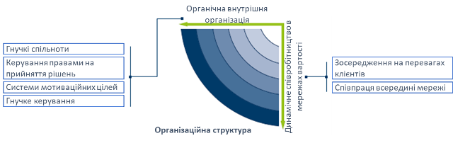

Рисунок 9: Можливості структурної області «організаційна структура»

- **Органічна внутрішня організація**. Органічна організація є антиподом механістичної організації. Її співробітники мають менше обмежень і високу індивідуальну відповідальність. Таким чином, ця форма організації особливо добре підходить для організацій з висококваліфікованою робочою силою, яка існує в динамічному середовищі.
  - Гнучкі спільноти. У гнучкої організації необхідні ресурси всередині компанії мають бути налаштовані динамічно. З точки зору організаційної структури компанії, це означає, що співробітники будуть змушені регулярно змінювати завдання, які вони виконують, і переходити в інші команди. Незважаючи на те, що вони й надалі будуть приписані до певного відділу в організаційній діаграмі компанії, на практиці вони виконуватимуть свою роботу як члени команд, орієнтованих на завдання або ціль. У той же час компанії необхідно сприяти співпраці між експертами з конкретних тем, створюючи паралельні групи експертів для вирішення спеціалізованих тем. Цей підхід спрямований на покращення зв’язку між різними відділами та об’єднання навичок співробітників. Це дозволяє компанії переконатися, що люди з різними навичками з різних частин бізнесу рухаються в одному напрямку для досягнення спільної мети. Тому те, як компанія організована, має забезпечувати співпрацю в окремих командах на основі потреб. Цей підхід зрештою призводить до концепції спільнот, де організаційні підрозділи формуються навколо певної теми (наприклад, впровадження нового ІТ-рішення) або завдання (наприклад, керування фрезерними верстатами). У той час як постійні спільноти можуть займатися повсякденною діяльністю компанії, інші спільноти можуть бути засновані на проектах і створюватися виключно на тимчасовій основі, перш ніж їх знову розформують. Мета цієї форми організації полягає в тому, щоб гарантувати, що робота виконується працівниками з відповідними навичками для роботи, незалежно від того, де вони сидять в ієрархії або до якого відділу належать. Переваги цієї концепції передусім стосуються інновацій та завдань, орієнтованих на вирішення проблем. У цих випадках найсильніші навички співробітників використовуються, якщо вони здатні гнучко брати участь у різних спільнотах. Ця форма організації має певні обмеження - для процесів, які вимагають високої ефективності та стабільності, ступінь гнучкості повинна бути обмежена. Гнучкі організації здатні підтримувати стабільні процеси, водночас здатні швидко адаптуватися. Це також дозволяє швидко реагувати на нові події та знання. 
  - Керування правами на прийняття рішень. При розподілі повноважень для прийняття рішень або виборі найкращої процедури прийняття рішень необхідно зважити один проти одного два протилежні механізми. Очевидно, що для прийняття правильного рішення має бути доступна вся відповідна інформація. Якщо рішення приймаються децентралізовано, місцеві особи, які приймають рішення, матимуть кращу інформацію про фактичні обставини, оскільки вони ближчі до фактів. Досягнення такої ж якості в централізовано прийнятому рішенні буде дорожчим через вартість передачі інформації на центральний рівень. З іншого боку, децентралізовані рішення також спричиняють витрати або через те, що вони не узгоджені належним чином одне з одним і, отже, потенційно не враховують те, що є найкращим для компанії в цілому, або тому, що вони вимагають додаткового втручання керівництва, щоб узгодити їх із рішеннями з загальними цілями компанії. Отже, певні рішення повинні прийматися централізовано, наприклад, рішення щодо стратегії компанії, тоді як інші рішення можуть бути прийняті більш економічно ефективними, якщо вони децентралізовані. Однією з переваг Industrie 4.0 є краща доступність інформації. Це означає, що навіть на децентралізованому рівні можна досягти прозорості щодо наслідків рішень та їх узгодженості з цілями компанії, забезпечуючи швидше та ефективніше децентралізоване прийняття рішень. Також можуть бути використані процеси колективного прийняття рішень. Це передбачає об’єднання зацікавлених сторін у компанії, які є найбільш компетентними для прийняття рішень з даного питання. Наприклад, члени експертних спільнот можуть бути обрані шляхом проведення свого роду експертної оцінки кандидатів. Подібним чином потенціал нових проектів розвитку може оцінювати вся робоча сила, а не лише жменька керівників. Компанії повинні розвинути здатність керувати правами прийняття рішень таким чином, щоб знайти правильний баланс між централізацією та децентралізацією, щоб максимізувати ефективність і ефективність процесів прийняття рішень.
  - Системи мотиваційних цілей. Для збільшення автономії працівників і забезпечення їх зосередженості на загальній меті компанії — досягнення цінності для клієнтів, необхідні відповідні системи цілей. Занадто конкретні цілі, які вимірюються одновимірно (наприклад, кількість вироблених штук), призводять до локальної оптимізації та до «силосного менталітету». Натомість компанії повинні запровадити багатовимірні системи цілей, які заохочуватимуть працівників зосереджуватися на ефективності процесів і постійному вдосконаленні. Це вимагає розвитку абсолютно нових компетенцій, таких як фінансовий контроль спільнот або вимірювання успіху команд експертів. Одним із прикладів можливої цілі для працівника, який працює у сфері розвитку, було б вимагати від нього виступати з певною кількістю презентацій на конференціях, у яких беруть участь експерти з-за меж компанії. Це забезпечило б цілеспрямований засіб заохочення їх піддавати власні ідеї критичній оцінці третіми сторонами. Системи цілей тісно пов'язані з системами оплати праці. Це не повинно створювати суто трансакційну організацію, де єдиним мотивом працівників є їхня оплата. Цілі та системи винагороди повинні поєднуватися, щоб забезпечити працівникам певну безпеку та впевненість у тому, що їм дозволено робити випадкові помилки, водночас мотивуючи їх вкладати всі свої навички в організацію. Це вимагає правильного поєднання грошових і негрошових стимулів, таких як можливості навчання, перспективи розвитку та особиста свобода 
  - Гнучке керування. Негнучкі звичайні процеси розробки не в змозі впоратися з нечіткими або мінливими вимогами, що виникають у динамічному середовищі. Натомість необхідні підходи характеризуються швидкою розробкою прототипу, конкретними (проміжними) результатами та високочастотними циклами зворотного зв’язку із зацікавленими сторонами. Одним із принципів, якого дотримуються гнучкі проекти розробки, є перевірка припущень і гіпотез про продукт або результат якомога раніше в реальному середовищі. Це передбачає зосередження на основній функціональності продукту, щоб створити так званий «мінімально життєздатний продукт» (MVP).  MVP — це товарні продукти з обмеженою функціональністю, які можна протестувати безпосередньо на ринку, що дозволяє систематично та швидко продовжувати розвиток продукту на основі відгуків споживачів. Ці підходи можна застосовувати не лише для розробки продуктів і послуг, але й для керування внутрішніми проектами. Фізичні виробничі процеси можна порівняти з цифровими моделями, щоб ідентифікувати можливості для подальшого вдосконалення. Іншим прикладом такого процесу є підхід Scrum, який виник у сфері розробки програмного забезпечення. Цей процес прискорює ініціативи безперервного вдосконалення за допомогою підходу до інновацій, який базується на даних і базується на принципі «почніть з малого та швидко розширюйте». Розумні продукти з дедалі більшою програмною функціональністю підтримують цей тип підходу, уможливлюючи широке спостереження на основі даних за поведінкою реальних користувачів, щоб функціональні можливості продукту згодом можна було покращити, увімкнути або навіть вимкнути. Ландшафт інтегрованої системи також діє як каталізатор для використання подібних методів у самій компанії. Наприклад, зміни в дизайні продукту можуть бути автоматично повідомлені всім відповідним учасникам (наприклад, у формі переглянутого графіка роботи).
- **Динамічне співробітництво в мережах вартості** Автоматизований та безперебійний обмін інформацією між різними компаніями дозволяє їм співпрацювати більш динамічно та забезпечує підвищену прозорість щодо ринку. Це також допомагає зменшити деякі бар’єри на шляху до більшої гнучкості, такі як ручні процеси для запитів, замовлення та обробки замовлень. Операційну видимість можна розширити, включивши в неї статус виробництва постачальника та показники якості за допомогою сучасних технологій IoT. Результатом є більш ефективний обмін інформацією, товарами та послугами.
  - Зосередження на перевагах клієнтів. Відповідно до концепції основної компетенції або «стратегічних позицій успіху», компанії повинні чітко зосередитися на обмеженій кількості компетенцій, щоб забезпечити унікальну пропозицію для ринку. Ця концепція стає ще більш важливою, оскільки ринки стають більш прозорими, а створення вартості стає все більш мережевим і динамічним. Динамічний ринок — це ідея, яка стане надзвичайно важливою. Постачальники, які досягнуть успіху на прозорому ринку з добре функціонуючими ринковими механізмами, будуть тими, хто найкраще зможе задовольнити індивідуальний попит. Зокрема, компанії мають визначити, як вони можуть сприяти задоволенню потреб кінцевого споживача. Навіть якщо компанія сама не доставляє продукцію безпосередньо кінцевому споживачу, її продукт або послуга все одно є частиною рішення кінцевого клієнта. Чим більший внесок у це рішення зробили окремі партнери, тим успішніше ці компанії зможуть виділитися серед конкурентів. Прикладом може бути виробник роликових підшипників, який зосереджується не лише на безпосередніх вимогах виробника машини, який є його прямим клієнтом, але й на тому, як його підшипники використовуються кінцевими користувачами машин. Аналізуючи дані про стан роликових підшипників за допомогою хмарного рішення, він може надавати кінцевому користувачеві додаткові послуги, які допомагають їм працювати з машиною ефективніше. Це глибоке розуміння вимог кінцевого клієнта також робить його більш привабливим, ніж конкуренти, для його безпосереднього клієнта (виробника машини), оскільки це означає, що загальне рішення, яке надає машина, більш успішно задовольняє потреби клієнта. Компанії повинні мати можливість постійно переглядати свої компетенції та, якщо необхідно, адаптувати їх до обставин, що змінилися. Вони також повинні точно визначити, яку роль вони повинні відігравати в мережі цінностей. Цільовий внесок спеціалізованих компетенцій у загальне рішення та інтеграція кількох окремих рішень для створення єдиного загального рішення можуть бути потенційно успішними стратегіями.
  - Співпраця всередині мережі. Компанії можуть свідомо прийняти стратегію або передати певні виробничі та транспортні операції на аутсорсинг, або позиціонувати себе як постачальників певних компетенцій для мережі вартості. Керування компетенціями означає систематичну інтеграцію компетенцій різних партнерів. Компанії, які об’єднують свої компетенції для задоволення конкретних потреб, здатні швидше реагувати на зміни вимог ринку. Працюючи разом, партнери можуть розробляти та постачати нові продукти, які вони ніколи не змогли б поставити самостійно або для яких спочатку потрібно було б розпочати тривалий внутрішній процес підвищення кваліфікації. Гнучкі ринки, які контролюють увесь ринок, уже існують сьогодні для менш складних стандартних послуг (наприклад, у сфері логістики). Одним з викликів є надання дуже точних описів, необхідних для торгівлі послугами. У  випадках, коли компанії, які раніше не співпрацювали, бажають  співпрацювати, не маючи при цьому довіри одна до одної, зусилля,  необхідні для переговорів про угоду про співпрацю, ймовірно, переважать  над перевагами короткострокової та потенційної співпраці, яка може бути  єдиноразовою. Управління цифровими правами відіграє важливу роль у цьому контексті. Безперебійний обмін конфіденційними даними, наприклад CAD-моделей супроводжується ризиком використання даних не лише за призначенням. Необхідно вжити запобіжних заходів, щоб забезпечення правильного доступу до даних для визначеної мети, наприклад використовувати модель CAD для запчастини, надрукованої на 3D, лише один раз, а не кілька разів.

Рис.10 показує характеристики, якими повинні володіти ресурси виробничої компанії після того, як вона досягла стадії зрілості «адаптивності». 

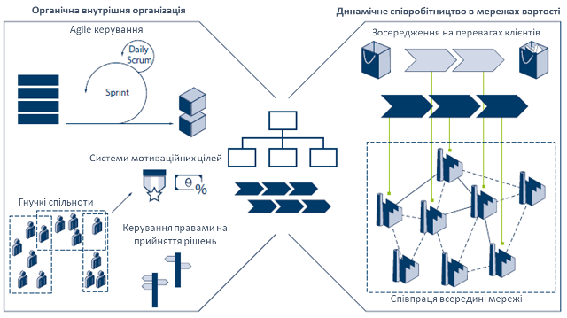

Рисунок 10: Можливості, необхідні в структурній області «Організаційна структура» 

### Культура

Гнучкість компанії сильно залежить від поведінки її співробітників. Досвід ощадливого менеджменту в 1990-х і 2000-х роках показав, що ключем до успішного впровадження ощадливого менеджменту в бізнесі є зміна культури компанії, іншими словами, зміна менталітету її співробітників. Те саме стосується цифрової трансформації в гнучку компанію, що навчається. Компанії не зможуть досягти бажаної гнучкості, якщо вони просто запровадять цифрові технології, не звертаючи уваги на свою корпоративну культуру. Натомість вони повинні почати з того, що вирішити, як вони хочуть, щоб їхня компанія працювала в майбутньому, і які навички знадобляться їхнім працівникам. Лише тоді вони повинні визначити та запровадити технології, необхідні для підтримки бажаного способу роботи. Показовим прикладом є цифрові системи допомоги. Саме по собі впровадження таких систем не додає цінності компанії. Перш ніж цифрові системи допомоги почнуть приносити додаткову цінність, компанія повинна створити культуру, за якої співробітники довірятимуть цим системам і будуть готові прийняти їхні пропозиції. Необхідна трансформація корпоративної культури заключається в двох ключових принципах. 

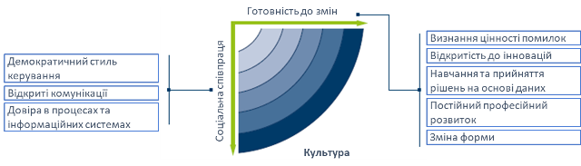

Рисунок 11: Можливості структурної області «культура»

- **Готовність до змін**. Ідеальний сценарій полягає в тому, щоб уся робоча сила була готова до змін. Крім того, ця готовність до змін не повинна обмежуватися ситуаціями, коли зміни вже впроваджуються. Важливо, що це також означає, що люди повинні дивитися на своє власне оточення та корпоративне оточення відкритими очима, розпізнавати, коли є можливість або потреба для змін, і самостійно ініціювати відповідні дії. Бажання змінюватися є першим принципом культури та ключовим фактором спритності. Перший принцип структурної області «культура» базується на п’яти здібностях, які не слід розглядати окремо одна від одної, бо лише коли вони поєднуються, вони призводять до бажання змінюватися.
  - Визнання цінності помилок. Гнучкі компанії що навчаються надають великого значення помилкам. Ці компанії зрозуміли, що процеси навчання та змін можуть бути започатковані лише за наявності помилок. Помилки надають можливість отримати краще розуміння процесів компанії та виявити раніше невідомі причинно-наслідкові зв'язки. Таким чином, спосіб, яким компанія вирішує проблему помилок, є ключовим аспектом її корпоративної культури. Існують два фундаментально різних підходи до помилок. Негативне ставлення до помилок відображається в стратегії, заснованій на систематичному уникненні помилок, жорстких покараннях за помилки та виправленні помилок якомога швидко та непомітно. Працівники компаній, де панує така культура, зазвичай не готові визнавати свої помилки. Це гальмує їх бажання змінюватись. З іншого боку, культура, яка визнає цінність помилок, характеризується відкритим обговоренням помилок при їх виникненні, систематичною документацією помилок та вирішенням причин помилок та їх рішень. При розслідуванні помилок критично важливо зосередитися на розумінні причин, а не на встановленні винних.
  - Відкритість до інновацій. Комплексне розуміння того, як працюють нові технології та підходи, є  необхідним, щоб забезпечити їх інтеграцію в компанію таким чином, щоб  вона приносила значну додану вартість. Переваги нововведень не завжди  відразу ж очевидні, оскільки спочатку люди не знайомі з технологіями,  які ще не використовувалися в компанії. Один з прикладів - використання  систем підтримки на основі даних в сільському господарстві. Оптимізація  маршруту, який пройде комбайн по полю, може збільшити врожайність на  20%. На ринку існує кілька систем, які можуть обчислювати оптимальний  маршрут на основі поточних екологічних умов та рівня заповненості  комбайну. Однак багато фермерів не хочуть змінювати звички попереднього  життя. Отже, один виробник сільськогосподарської техніки вирішив  встановити свою систему безкоштовно на пробній основі. Це дало  можливість фермеру побачити безпосередню користь від використання  системи та переконатися, що настав час починати робити речі по-іншому.  Пробний період продемонстрував значення «прихованих» даних та  інформації, отриманої з них. Готовність до інновацій та нових способів  роботи є важливою здатністю, яка потрібна для запуску змін та прийняття  правильних заходів, навіть якщо вони іноді є дещо незвичними.
  - Навчання та прийняття рішень на основі даних. Інноваційні цикли виробничих компаній стають все коротшими. Іншими  словами, на розробку адекватних відповідей на зміни в бізнес-середовищі  залишається менше часу. Це також означає, що помилки необхідно виявляти  якомога швидше та ідентифікувати їх причини. Замість вирішення проблем  за допомогою інтуїції, важливо отримувати розуміння причин помилок на  основі даних, щоб приймати відповідні заходи для їх вирішення.  Навчальні, гнучкі компанії здатні до цього, оскільки вони постійно  відслідковують свої процеси додавання вартості, за допомогою збору  відповідних даних. Потім аналізують ці дані, порівнюючи цифрову модель з фізичними даними та приймають заходи на основі результатів аналізу.  Їхні співробітники мають довіру до даних та готові навчатися на їхніх  основах та приймати рішення на їхній підставі. Наприклад, в Google  рішення співробітників щодо нових заходів ґрунтуються майже виключно на  даних, які були зібрані та проаналізовані. Це можливо через те, що  працівники зобов'язані до постійного вдосконалення та розуміють, що  рішення не повинні ґрунтуватися виключно на досвіді однієї людини. Вони  розуміють, що прийняття рішень на основі даних дає швидші та кращі  результати, ніж покладатися на досвід окремих осіб.
  - Постійний професійний розвиток. Цифровізація промисловості кардинально перетворює набір навичок,  необхідних для працівників виробничих компаній. Зміни в технології  виробництва та все більше використання інформаційно-комунікаційних  технологій означають, що потрібні навички змінюватимуться все частіше.  Якщо раніше було величезне попит на спеціалістів з глибокими знаннями,  то в майбутньому зростатиме попит на "універсальних спеціалістів". Це  працівники, які мають міждисциплінарне розуміння взаємопов'язаних  процесів та можуть швидко набути необхідні спеціалізовані знання. Такі  працівники розуміють, що деякі з навичок та знань, які вони набули в  минулому, залишаться корисними тільки на обмежений час. Вони  характеризуються бажанням навчатись протягом усього життя. Факт того, що вони стежать за змінами у своєму середовищі, означає, що вони швидко  визначають будь-які нові потреби у навчанні. Тому вони можуть разом  формулювати програми навчання, які відповідають необхідним компетенціям і задовольняють потреби працівників.
  - Зміна форми. Чим швидше компанія може забезпечити адекватну відповідь на зовнішні  події, тим більші переваги зміни матимуть для тих, на кого вони  впливають. Тому необхідно ініціювати, реалізувати та завершити правильні зміни якомога швидше. Для цього важливо забезпечити, щоб ініціатива  була взята тими працівниками, які найкраще зможуть інтерпретувати  зовнішню подію на основі своїх знань. Оскільки це часто будуть  працівники, які найбільше працюють з системою або машинами, вони не  обов'язково мають повноважень приймати рішення. Тому важливо передавати  повноваження, надавати працівникам більше можливостей для дій та давати  фахівцям з відповідною технічною експертизою можливість ділитися своїми  знаннями. Однак критичним фактором є розуміння працівниками, що вони  також несуть відповідальність за формування змін. Замість простого  прийняття змін, вони повинні бути готові ініціювати їх самостійно і бути готові взяти перший крок для їх втілення.
- **Соціальна співпраця**. Ідеальний сценарій полягає в тому, щоб працівники вірили, що їхні дії повинні повністю базуватися на знаннях. Термін «знання» охоплює будь-які знання, отримані шляхом цілеспрямованого спостереження, випадково, шляхом аналізу даних або практичного досвіду. Середовище, яке характеризується довірою та соціальними стосунками, створює основу для відкритого, вільного обміну знаннями між співробітниками. Отже, другий принцип культури, соціальна співпраця, допомагає прискорити обмін знаннями в компанії. 
  - Демократичний стиль керування. Частотні зміни в оточуючому середовищі вимагають швидких, але не  втрачених якості, рішень щодо того, як відреагувати на них. Окрім  забезпечення належних знань для прийняття відповідних заходів,  необхідно, щоб процеси прийняття рішень стали швидшими. Більш гнучкий  підхід до прийняття рішень та надання більшого простору дії працівникам  створює організаційний каркас для швидшого прийняття рішень. Окрім  створення належного каркасу, дуже важливо, щоб співробітники мали довіру один до одного, щоб рішення не тільки приймалися швидко, а й  втілювалися в життя. Замість розглядання співробітників як ресурсів,  керівництво повинно цінувати їх як частину спільноти через компетенції,  які вони приносять на стіл. Основною здатністю, яка дозволяє це зробити, є демократичний стиль керування.
  - Відкрите спілкування. Для того, щоб компанії могли швидко реагувати на непередбачені події в своєму середовищі, їхні співробітники в ідеалі повинні мати миттєвий доступ до необхідних явних і неявних знань. Хоча явні знання можна надати за допомогою відповідних комунікаційних технологій, обмін неявними знаннями вимагає прямого спілкування між людьми, які володіють знаннями, і людьми, які їх шукають. Наприклад, коли виробниче обладнання пошкоджується або виникає несправність, працівники технічного обслуговування можуть отримати доступ до більшості виробничих параметрів, які їм необхідно проаналізувати, через відповідні інформаційні системи (системи MES/ERP). Однак власний досвід операторів щодо роботи з машинами та інформація, яка не фіксується датчиками, наприклад зміни рівня шуму, можуть надаватися лише безпосередньо між працівниками. Отже, робоча сила повинна припинити мислити категоріями жорсткої ієрархії та відмовитися від ментальності «ми і вони». Співробітники набули здатності до відкритого спілкування, якщо, взявши до уваги той факт, що відкритий обмін знаннями та спільна робота для досягнення бачення збільшує загальну суму знань, вони також діють відповідно. Коли вся робоча сила організації хоче ділитися знаннями з усіма, стає можливим значно прискорити процеси навчання в компанії.
  - Довіра до процесів та інформаційних систем. Уроки впровадження інформаційних технологій з 1970-х років вчать нас, що недостатньо зосереджуватися виключно на функціональних вимогах. Прийняття та систематичне використання інформаційних технологій і систем може бути забезпечено лише в тому випадку, якщо відповідний персонал буде включений у процес змін із самого початку та може брати активну участь у формуванні змін. Окрім залучення працівників до проектування відповідних інформаційних систем, усі працівники повинні розуміти, що переваги цих інформаційних систем будуть реалізовані лише за умови їх систематичного використання всіма. Той факт, що працівники гнучких компаній, що навчаються, довіряють обраним процесам та інформаційним системам, дає змогу швидко обмінюватися задокументованими знаннями на основі ролей, контекстуально. Ця впевненість базується на тому факті, що співробітники розуміють, як інформаційна система приймає рішення, і визнають конкретні переваги її рекомендацій. Однак водночас вони критично дивляться на систему та прагнуть вдосконалювати її власними знаннями в інтересах постійного вдосконалення.

Рис.12 показує характеристики, якими повинні володіти ресурси виробничої компанії після того, як вона досягла стадії зрілості «адаптивності». 

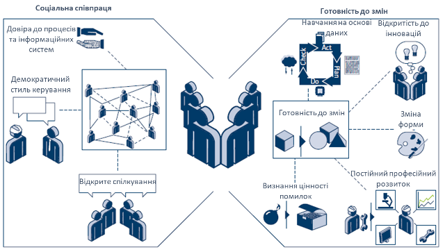

Рисунок 12: Можливості, необхідні в структурній області «Культура» 

## Визначення етапів зрілості

Запровадження Industrie 4.0 передбачає суттєве вдосконалення цифрових компетенцій і можливостей виробничої компанії та тягне за собою зміни у великих частинах організації. Оскільки ця трансформація є дуже складним заходом, вона зазвичай займає кілька років. Її слід планувати та впроваджувати таким чином, щоб забезпечити позитивний вплив на прибутковість, тобто зростання та ефективність, на різних етапах трансформації. Переваги мають бути видимими на будь-якому етапі процесу трансформації, щоб підтримувати його загальний успіх. Цей підхід забезпечує швидкі перемоги, водночас просуваючись до загальної мети трансформації.

Як вже було зазначено вище, шлях перетворення складається з шести етапів. Кожен етап ґрунтується на попередньому та описує можливості, необхідні для його досягнення, і отримані переваги для компанії (див. рис. 2). Важливо, щоб можливості створювалися крок за кроком, тобто переваги першого етапу можуть бути досягнуті з нижчим рівнем можливостей, ніж другий етап. Процес трансформації — це безперервна подорож із багатьох послідовних кроків, які виконуються поступово й можуть не бути повністю синхронізовані між підприємствами, заводами, лініями та відділеннями. Кожна компанія сама вирішує, який етап розвитку представляє найкращий баланс між витратами та вигодами для її власних конкретних обставин, і тому його слід прийняти як цільовий стан для завершення запланованого процесу трансформації. 

Рисунок 2. Етапи шляху розвитку Industry 4.0

Нижче наведений опис етапів в контексті кожної структурної області.

### 1: Комп'ютеризація (Computerisation )

Першим етапом шляху розвитку є комп’ютеризація, оскільки це створює основу для цифровізації. На цьому етапі всередині компанії різні інформаційні технології використовуються ізольовано одна від одної. У більшості компаній комп’ютеризація вже добре розвинена і в основному використовується для більш ефективного виконання повторюваних завдань. Але при цьому відсутність зв'язку між комп'ютеризованими частинами не дає використовувати їх сумісно більш ефективно. 

Прикладом цього етапу розвитку може бути фрезерний верстат з ЧПК (числовим програмним керуванням). Незважаючи на те, що він може обробляти деталі з високою точністю завдяки використанню числового керування комп’ютером, дані САПР, які детально описують, які дії потрібно виконати, все одно доводиться передавати на фрезерний верстат вручну. Інший приклад стосується систем бізнес-застосунків, які не підключені до ERP-системи компанії. Це може призвести, наприклад, до ситуації, коли на випробувальній станції виконується напівавтоматичне забезпечення якості, але записані дані не пов’язані з відповідним робочим замовленням. Через це набагато складніше згодом визначити, які проблеми з якістю виникли в яких замовленнях. 

Компанії на цій стадії зазвичай мають традиційну організаційну структуру, орієнтовану на ефективну роботу окремих відділів. Зміни та інновації вважаються справою керівництва і повідомляються працівникам за допомогою фіксованих каналів зв’язку.

### 2: Підключення (Connectivity )

На етапі підключення більшість компонентів на різних рівнях керування пов'язані між собою. Бізнес-застосунки пов’язані між собою та відображають основні бізнес-процеси компанії. 

Для прикладу, після того, як проект було створено в сфері інженерної діяльності, його дані можуть бути передані у виробництво, щоб можна було виконувати відповідні етапи виробництва (процеси CAD/CAM). Після завершення виробничого етапу через систему керування виробництвом (MES) автоматично та в режимі реального часу може бути надано підтвердження. Завдяки наявності дешевих каналів передачі даних великого обсягу виробники верстатів можуть виконувати дистанційне технічне обслуговування виробів, які використовують їхні клієнти. 

Таким чином на цьому етапі усі компоненти мають можливість підключення до єдиної мережної системи, але повної інтеграції на рівні всієї компанії ще немає. Системи керування різного рівня, наприклад операційними технологіями (OT) та IT все ще працюють ізольовано.

### 3: Спостережність (Visibility )

Традиційним підходом отримання інформації з реального об'єкту є використання тільки тих датчиків, які використовуються для керування та контролю роботи обладнання або процесу в оперативному режимі. Однак використання різноманітних датчиків для вимірювання всебічного стану всіх активів дає можливість  фіксувати всі аспекти їх роботи, і це потрібно спостерігати не тільки в середині компанії, а і за її межами. Це дає можливість постійно підтримувати актуальну цифрову модель (представлення) стану всього заводу, а не тільки відділень стосовно до їх виробничої діяльності. Дослідники acatech називають таку модель **цифровою тінню** компанії (**digital shadow**). Цифрова тінь може допомогти показати, що відбувається в компанії в будь-який момент, що у свою чергу дає можливість формувати керуючі рішення на базі реальних даних. Побудова цифрової тіні є основою для всіх наступних етапів. 

Створення цифрової тіні є серйозною проблемою для багатьох компаній, оск кілька з них. 

- відсутність  **єдиного джерела правди** **(source of truth**), оскільки дані часто зберігаються в децентралізованих базах даних (**silos**);
- часто збирається дуже мало даних для таких функцій, як виробництво, логістика та послуги, навіть у централізованих процесах;
- зібрані дані в багатьох випадках видимі лише обмеженій кількості людей, які мають доступ до відповідних доменних систем і розуміють їх; більш широке використання даних заборонено за межами системи. 

Щоб досягти мети гнучкого підприємства, яке навчається, для надання відповідних даних про діяльність у всьому бізнесі має важливе значення комплексний збір даних у всій компанії.

Наприклад, за допомогою реал-тайм KPI (Key Performace Indicator, ключові показники ефективності) та інформаційних панелей є можливість швидше визначати відхилення дати доставки, викликане конкретною проблемою. Після чого виробничий план може коригуватися керівником виробництва, а клієнти та постачальники можуть бути в курсі ситуації.

Це одна зі сфер, де компанії повинні змінити спосіб мислення. Замість того, щоб лише збирати дані для проведення конкретного аналізу або підтримки спеціальної операції, вони повинні мати можливість створити оновлену модель усієї компанії в будь-який час, яка не прив’язана до аналізу окремих даних. Поєднання існуючих джерел даних із датчиками в цеху може принести значні переваги. Інтеграція систем PLM, ERP і MES забезпечує повну видиму картину щодо плинного стану. Крім того, модульні підходи та програми можуть допомогти створити єдине джерело правди.

Однак створення спостережності — це не лише технологічний виклик, але й потреба у змінах в організаційній структурі та корпоративній культурі компанії. Платформи для співпраці допомагають зміцнити співпрацю між різними частинами бізнесу. Це приводить до необхідності руйнування традиційних операційних структур і більш тісне залучення співробітників до процесу змін, з метою забезпечення швидкого реагування на зміну вимог клієнтів. Це також вимагає неієрархічної культури спілкування, де можна вільно обговорювати інновації та зміни в усталених процесах і де основна увага приділяється бажанню вдосконалення. Співробітникам комфортно працювати з новим рівнем спостережності, а також вони хочуть, щоб їхні власні здібності були спостережні через матриці якості.

### 4: Прозорість (Transparency )

Попередній (третій) етап передбачає створення цифрової тіні для контролю поточної ситуації компанії в усіх її сферах. Наступним етапом для компанії є розуміння того, чому щось відбувається, і використання цього розуміння для отримання знань за допомогою аналізу першопричин. Щоб ідентифікувати та інтерпретувати взаємодії в цифровій тіні, отримані дані потрібно проаналізувати за допомогою інженерних знань. Це забезпечується через семантичне зв’язування та агрегування даних для створення інформації та відповідної контекстуалізації.  Розуміння плинного стану процесу сприяють підтримці складного та швидкого прийняття рішень.

Тут стають в нагоді нові технології, які підтримують аналіз великих обсягів даних (**великі дані** , **big data**). Застосунки для аналізу великих даних забезпечують загальну платформу, яку можна використовувати, наприклад для проведення обширного стохастичного аналізу даних, для виявлення взаємозв'язків в цифровій тіні компанії, яка як вже було зазначено включає дані з усіх сфер та рівнів керування.  

Така прозорість щодо відповідних взаємодій може, наприклад, використовуватися для здійснення моніторингу стану машин і обладнання. У записаних значеннях параметрів здійснюється пошук взаємних подій і залежностей, які потім агрегуються для створення складних подій, що відображають стан машини чи обладнання. Крім усього іншого, прозорість є обов’язковою вимогою для прогнозного обслуговування.

Переваги використання великих даних залежать не лише від технологічних аспектів – вони також вимагають готовності використовувати дані в процесах прийняття рішень на всіх рівнях ієрархії компанії. Співробітники ініціюють зміни та інновації та беруть участь у їх впровадженні, результатом чого є співпраця між фахівцями різних підрозділів. Використання методів гнучкого керування процесами змін означає, що переваги починають з’являтися протягом короткого періоду часу.

### 5: Прогнозна здатність (Predictive capacity)

Спираючись на етап прозорості, наступний етап розвитку – це здатність до прогнозування. Досягнувши цього етапу, компанія може моделювати різні майбутні сценарії та визначати найбільш ймовірні. Це передбачає проектування цифрової тіні в майбутнє, щоб відобразити різноманітні сценарії, які потім можна оцінити з точки зору ймовірності їх виникнення. Завдяки цьому компанії можуть передбачати майбутні події, щоб своєчасно приймати рішення та впроваджувати відповідні заходи. Хоча заходи все ще потрібно виконувати вручну, довші терміни виконання допомагають обмежити негативний вплив. Зменшення кількості несподіваних подій, спричинених наприклад через збої або розбіжності в плануванні забезпечує більш надійну роботу бізнесу. Це дає змогу, наприклад, позначати повторювані логістичні проблеми, такі як збій перевізника, ще до їх виникнення, щоб їх можна було запобігти, у цьому випадку шляхом зміни перевізника.

Спроможність компанії передбачити значною мірою залежить від роботи на попередньому етапі. Правильно побудована цифрова тінь у поєднанні зі знанням відповідних взаємодій допоможе забезпечити високий рівень як прогнозів, так і рекомендацій на їх основі.

Коли компанії зможуть передбачити майбутні події, вони також повинні бути готові вжити будь-яких заходів, необхідних для мінімізації потенційного негативного впливу цих подій. Це веде за собою організаційні та культурні зміни всередині компанії. Співробітникам потрібно буде надати скориговані повноваження щодо прийняття рішень, щоб забезпечити швидке прийняття рішень у разі потреби. Необхідно буде змінити організаційну структуру, щоб потенціал можна було швидко адаптувати до нових ситуацій. Здатність передбачити також вимагає критичного осмислення та відкритості до змін.

### 6: Адаптивність (Adaptability )

Передбачувана здатність є фундаментальною вимогою для автоматизованих дій і автоматизованого прийняття рішень. Постійна адаптація дозволяє компанії делегувати певні рішення ІТ-системам, щоб вона могла адаптуватися до мінливого бізнес-середовища якомога швидше.

Ступінь адаптивності залежить від складності рішень і співвідношення витрат і вигод. Часто найкраще автоматизувати лише окремі процеси. Відповідно, слід дослідити принципову можливість автономного виконання повторюваних операцій. Однак важливо ретельно оцінити ризики автоматизації схвалень і підтверджень для клієнтів і постачальників. Приклади включають зміну послідовності запланованих замовлень через очікувані несправності машин або щоб уникнути затримок доставки.

Мета адаптивності вважаєься досягнутою, коли компанія може використовувати дані з цифрової тіні для прийняття рішень, які мають найкращі результати в найкоротші терміни, і впроваджувати відповідні заходи автоматично, тобто без допомоги людини.

Адаптивність також висуває низку вимог до самої компанії. Він вимагає динамічної співпраці в мережі цінностей, щоб постійно переглядати як наявні навички, так і розвиток основних компетенцій, щоб їх можна було коригувати за необхідності. Зміни сприймаються як норма. Гнучкі спільноти та гнучке управління проектами створюють органічну організацію. Прийняття підходу, заснованого на знаннях, вимагає постійного накопичення знань і навчання протягом усього життя для працівників.

## Функційні області

В Індексі зрілості описані вище можливості досліджуються окремо для кожної функційної області компанії (рис.13). Конкретний етап зрілості кожної можливості може бути різним для різних функційних областей і бізнес-процесів, які в них містяться. Нижче наводиться опис ключових можливостей для кожної функційної області, яка розбивається на чотири структурні області. Щоб полегшити використання моделі, функційні області досліджуються на рівні складових бізнес-процесів.

Рисунок 13. Індекс зрілості в контексті концепції «Фреймворку виробництва та керування»

### Розроблення (Development)

У функції розроблення виробничих компаній відбуваються фундаментальні зміни , оскільки технологічні, культурні та організаційні аспекти Industrie 4.0 все більше проникають у корпоративні процеси. Традиційна теорія проектування Pahl & Beitz (основна теорія проектування в механічній інженерії, розроблена в Німеччині в 1960х), а також підхід до  проектування мехатронних систем, викладений у стандартах VDI 2221 та VDI 2206, відступають на другий план на користь реалізації того, що не всі  вимоги клієнта відомі або можуть бути належним чином враховані на  початку процесу розроблення. Замість того, щоб починати з жорстко закінченого продукту, все частіше працюють з його баченням, яке може продовжувати еволюціонувати відповідно до нових вимог та  автоматизованих запитів на зміни на протязі етапу розроблення, навіть коли продукт уже використовується.

- **Ресурси**. Окрім висококваліфікованого персоналу, який дотримується міждисциплінарного підходу до своєї роботи, основним ресурсом функції розроблення є продукти. Компанія зберігає свою зосередженість на продукті навіть після того, як вона поставила його замовнику – польові дані від користувачів продукту є вхідними для цілеспрямованого подальшого розроблення. Для цього потрібні продукти, здатні збирати та передавати дані. Крім того, деякі функції продукту можна оновлювати та змінювати за допомогою програмного забезпечення. Це надає компанії нові можливості для ефективного керування випусками за короткий цикл – нові функціональні можливості можна додавати до продуктів ще довго після їх виведення на ринок, а несправності можна швидко виправляти. Процеси адитивного виробництва є ще одним цінним ресурсом. Систематичне впровадження цієї технології у відповідні процеси має вирішальне значення для забезпечення того, що прототипи та промотипи можуть бути створені швидко та економічно ефективно.

- **Інформаційні системи**. Розроблення здійснюється невеликими міждисциплінарними командами на віртуальних платформах, які дозволяють співпрацювати між компаніями. Це вимагає створення повної цифрової моделі процесу розроблення в первинній системі, такій як система PLM. Цей підхід забезпечує прозору картину функціональних тестів і залежностей компонентів, вимог і змін протягом усього життєвого циклу продукту. Модель є цифровою тінню продукту. Запити на зміни, що стосуються задокументованих залежностей, можна автоматизувати, тим самим значно покращуючи швидкість реагування процесу розробленя продукту. Системна інтеграція не обмежується сферою розроблення. Співпраця з іншими прямо чи опосередковано пов’язаними напрямками забезпечує доступність найновішої документації щодо продукту та відгуків про продукт. Дані також надаються виробничому відділу, щоб працівники виробництва мали доступ до останніх версій проектних документів, таких як креслення та списки деталей. Це гарантує, що виробничі та монтажні групи будуть безпосередньо поінформовані про будь-які зміни в продукті.

- **Організаційна структура**. Такі гнучкі методи, як Scrum, революціонізують процес розробки не лише в розробці програмного забезпечення, але й у всіх дисциплінах, завдяки чому вимоги можна реалізувати за допомогою коротких ітераційних циклів, зосереджених на окремих аспектах бачення продукту. Замість того, щоб загрузнути в теоретичній специфікації деталей продукту на початку процесу розроблення, мета полягає в тому, щоб якомога швидше перевірити ключові гіпотези про продукт. «Примотипи» надають конкретну інформацію на основі фактичного використання та відгуків користувачів. Замість того, щоб просто перевіряти функціональність, ці прототипи, які виготовляються за майже серійними процесами, реалізують концепцію «мінімально життєздатного продукту». Це дозволяє включати відгуки клієнтів у процес розроблення, щоб визначити конкретні вимоги клієнтів, значно скорочуючи як час, необхідний для впровадження продукту, так і пов’язані з цим витрати. Невід’ємною частиною цього підходу є те, що робити помилки на ранніх стадіях процесу та вчитися на цих помилках. Проектні рішення для примотипів ґрунтуються як на даних, так і на припущеннях. Реальні дані від людей, які використовували продукт, і вимоги клієнтів, задокументовані відділом маркетингу та продажів, доповнюються формальними знаннями про проектування, виготовлення та монтаж, щоб забезпечити безперервний аналіз даних з метою покращення якості продукту та економічної ефективності. Міждисциплінарна співпраця за межами етапу розроблення також має вирішальне значення для досягнення успіху. Такі підходи, як системна інженерія та сервісна інженерія, стають все більш важливими для забезпечення систематичного вивчення продукту протягом усього життєвого циклу продукту. Модульне розроблення продукту сприяє співпраці з іншими компаніями в мережах. Партнери розробляють функціональні модулі аж до моменту, коли вони готові до серійного виробництва. Однак і в цьому випадку їм спочатку надаються лише дуже загальні специфікації (наприклад, розміри продукту або цільова ціна), а детальні специфікації розробляються в процесі розроблення. Важливо переконатися, що люди, які працюють над модулями, застосовують міждисциплінарний підхід, щоб уможливити розробку інноваційних та ефективних рішень. Мета полягає в тому, щоб прискорити процес індустріалізації продукту шляхом побудови окремих модулів, готових до виробництва.

- **Культура**. Радикальна трансформація процесу розроблення призводить до зміни культури компанії. З самого раннього етапу клієнтам пропонуються ідеї, концепції та примотипи, які навмисно ще не повністю розроблені, щоб нефункціональні можливості виявлялися якомога раніше в процесі. Цей підхід також містить концепцію «мінімально життєздатного продукту», яка передбачає якнайшвидше створення продукту лише з найнеобхіднішими функціями. Цей менталітет дуже відрізняється від перфекціоністського підходу, який поширений сьогодні. Навмисне допускання помилок і конструктивне вирішення їх стане важливими аспектами культури в майбутньому. Культура компанії також характеризується поняттям внутрішньої та зовнішньої співпраці. Ідеї оцінюються на основі їхньої корисності, а не того, звідки вони походять. Спирається на низку різних джерел, у тому числі наприклад на тісну співпрацю з клієнтами та спостереження за ними або участь у спільнотах практиків з іншими компаніями та установами. 

### Виготовлення (Production)

Виготовлення (основне виробництво) залишиться серцем підприємств майбутнього, оскільки техніки  виробництва та збірки продовжують розвиватись. Спосіб обробки та  виробництва продуктів повинен бути вирівняний з вимогами клієнта щодо  продукту, що робить необхідними нові стратегії створення вартості.  Компанії будуть фокусуватися на своїх основних компетенціях. Факт того,  що вони стануть частиною справжньої мережі створення вартості, знизить ступінь вертикальної інтеграції. Це також дозволить більшу гнучкість  щодо характеристик продукту та портфоліо для задоволення індивідуальних  потреб клієнтів. Екосистема партнерства також забезпечить більшу  спрямованість на клієнта, а також більш ефективні способи виробництва  бажаних (затверджених) товарів. Для забезпечення конкурентоздатності  компаній у країнах з високим рівнем зарплат, буде необхідно забезпечити ефективне використання ресурсів, дозволяючи краще приймати рішення на  виробничому майданчику.

-  **Ресурси**.  Ресурси є ключовими для створення вартості у виробничих компаніях. Інформаційно-комунікаційні технології можна використовувати для вдосконалення раніше ізольованих або повністю пасивних об'єктів, створюючи кіберфізичні системи (CPS). З’єднання цих об’єктів один з одним і з відповідними інформаційними системами забезпечує абсолютно новий рівень прозорості у виробничому середовищі, що зрештою призводить до створення цифрової тіні. Реальні дані з цеху фіксуються безліччю датчиків, обробляються в інформацію та використовуються для прийняття рішень. Потім для реалізації вибраних заходів використовуються допоміжні системи або приводи в CPS. Протягом усього процесу створення вартості продукти та матеріали в області виготовлення чітко розподіляються за певним замовленням. Інформація про виконання замовлення в реальному часі доступна в будь-який час і в будь-якому місці. Виконання цілі постійно контролюється, і надаються надійні прогнози щодо впливу будь-яких відхилень. Оператори повинні мати можливість безпечно керувати кількома машинами, оскільки вони стають дедалі складнішими. Аналіз зібраних даних дозволяє персоналу з планування виробництва та контролю виявити нові зв’язки між відхиленнями в плануванні та виробничими процесами. Такі експерти, як керівники, бригадири та керівники змін, можуть зосередитися на прийнятті неавтоматизованих рішень і працювати з дослідниками даних для дослідження причин несправностей.

- **Інформаційні системи**. У виробничому середовищі інформаційні системи продовжуватимуть забезпечувати основу для управління та розподілу людських і технологічних ресурсів. Однак монолітні структури зникнуть, а дані надходитимуть із єдиного джерела правди, але з доступом для різних програм. Динамічно конфігуровані системи планування виконуватимуть складні обчислення для максимізації продуктивності незалежно від функції управління ресурсами. Результати будуть доставлені працівникам у цеху з урахуванням контексту та на кінцевому пристрої за їх вибором. Співробітники також матимуть доступ до набору ролей і застосунків для конкретних завдань. У завтрашніх мережах вартості бізнес-застосунки компаній використовуватимуться не лише всередині компанії, але й підключатимуться до систем їхніх постачальників, клієнтів та інших партнерів у мережі вартості. Ці дані будуть включені в єдине джерело правди. Висока доступність і якість наданих даних покращать реакцію всіх учасників. Стратегії «точно вчасно» та «точно в послідовність» стануть ще важливішими, дозволяючи зменшити рівень запасів, оптимізувати незавершене виробництво та мінімізувати затримку в ланцюзі постачань. Науковці з даних та експерти з процесів працюватимуть разом, використовуючи методи аналізу даних, щоб перевірити якісні дані, дані про стан машин і обладнання та параметри процесу для перетворення цієї інформації в знання. Метою буде знайти оптимальне вирішення конфлікту цілей між логістичними витратами та логістичними показниками.

- **Організаційна структура**. Безпроблемна співпраця між партнерами є ключем до створення вартості в мережі. Компанії, задіяні в мережі вартості, забезпечують потужність машин і виробничий досвід. Натомість вони отримують доступ до зовнішнього досвіду та потенціалу. Основні компетенції в спеціалізованих виробничих процесах і потенціал персоналу рекламуються на віртуальних ринках і динамічно встановлюються в ціні залежно від поточного використання потужностей компанії. Традиційні ієрархії ланцюгів постачання частково замінені неієрархічними структурами, що базуються на компетенціях і можливостях. Цехові команди більше не призначені для роботи лише над кількома завданнями, а натомість є частиною міждисциплінарної команди, відповідальної за продукт у цілому. Регулярний діалог щодо конкретних продуктів між членами різних відділів, таких як контроль якості, виробництво компонентів, планування та контроль основного виробництва, сприяє обміну знаннями та постійному навчанню. Це також дозволяє, наприклад запити на зміни від інженерної функції, які легко впроваджувати у виробництво. Співробітники мають право приймати власні рішення, щоб забезпечити швидший час реагування. Як нові, так і старі рішення документуються, спільно оцінюються та перетворюються на структуровані знання. Співробітників оцінюють як за бажанням ділитися знаннями, так і за результатами роботи.

- **Культура**. Зміна культури компанії щодо помилок може розкрити значний потенціал у сфері виробництва. Обговорення помилок дозволяє виявити слабкі місця у відповідних процесах і, можливо, вирішити їх. Може виявитися корисним запозичити певні ідеї з економічного виробництва – впровадження процесів безперервного вдосконалення та методів керування цехом може сприяти відкритому обговоренню помилок. Оскільки завдання, які повинні виконувати працівники, стають дедалі складнішими та різноманітнішими, їм потрібно буде активніше ділитися передовим досвідом один з одним. Щоб це стало можливим, терміново необхідні відповідна модерація та документація. У майбутньому, зокрема, цехові працівники набагато частіше стикатимуться з ІТ-системами.

### Логістика (Logistics)

З точки зору логістики, пріоритетом для гнучких компаній, що навчаються, є задоволення потреб клієнтів, споживачів і користувачів їхніх послуг. Логістика розуміється як інтегративна, наскрізна функція як всередині, так і поза компанією (зміни, описані тут, стосуються переважно логістики у виробничих компаніях, а не змін, що впливають на постачальників логістичних послуг). Основна функція логістики залишається незмінною: забезпечити наявність потрібних товарів у потрібній кількості, у потрібному місці, у потрібний час, для потрібного клієнта та за правильною ціною. Це стосується не тільки готової продукції, а й запасних частин, щоб забезпечити доступність проданих машин і активів. Однак зміна парадигми, спричинена Індустрією 4.0, призведе до фундаментальних змін у пов’язаному інформаційному потоці, що вплине на весь процес логістики. У результаті логістика стане більш тісною інтеграцією в загальний ланцюжок створення вартості, і відбудеться перехід до логістики, орієнтованої на обслуговування, на вимогу. 

- **Ресурси**. Обладнання для обробки матеріалів і упаковка оснащені такими інформаційними технологіями, як маяки або технологія систем визначення місцезнаходження в реальному часі (RTLS). Технічні ресурси, такі як вилкові навантажувачі, здатні самостійно ідентифікувати себе, визначати своє поточне місцезнаходження та фіксувати дані про свій статус і вантажі, що транспортуються. Існує повна інформаційна прозорість щодо термінів зберігання, місця та кількості товарів, що зберігаються. Підключені товари автономно передають відповідну інформацію, наприклад, про свій стан. Автономні транспортні засоби також включені в цей процес спілкування. Вони здатні до децентралізованої агрегації даних, що дозволяє їм взаємодіяти з іншими транспортними одиницями, щоб автономно виконувати функції керування транспортними засобами та замовленнями за допомогою ройового інтелекту на основі агентів.

- **Інформаційні системи**. Сервісно-орієнтована логістика на вимогу спирається на інтегровані інформаційні системи, які забезпечують постійний зв’язок між відправником і одержувачем. Інтегровані ІТ-системи дозволяють одержувачу, наприклад виробничому відділу, автономно запитувати на товар. Той факт, що транспортні одиниці, автономні транспортні засоби та складські приміщення підключені до цих систем, створює цифрову тінь реального світу. Ця віртуальна модель усіх компонентів процесу забезпечує керування на основі моделювання з використанням даних у реальному часі, а також автоматичний моніторинг і документування в реальному часі. Система порівнює поточний стан процесу з цільовими даними. У разі відхилень план переглядається, а поточні послідовності процесів коригуються автономно. Зміни повідомляються відповідним транспортним засобам або відображаються їх водіям, щоб вони могли бути впроваджені з негайним ефектом.

- **Організаційна структура**. Вирішальною організаційною зміною в галузі логістики буде більша автономія прийняття рішень, доступна для логістичних партнерів. Децентралізоване прийняття рішень сприяє економічнішому плануванню логістики, оскільки зв’язок забезпечує учасникам доступ до віртуальної моделі процесів. Глибоке розуміння процесів, що стосуються входу та виходу, дозволяє тісно інтегрувати логістику в мережу цінностей. Замість того, щоб логістичні операції розподілялися між окремими людьми чи транспортними засобами, логістичні платформи використовуються для визначення того, хто найкраще підходить для виконання даної операції. Рішення ґрунтується на таких критеріях, як поточне місцезнаходження, якнайшвидший час доставки та вартість. Згодом ці розробки призведуть до ще більшої кількості сторонніх логістичних підприємств. Остання миля може бути обслужена тим, хто запропонує найнижчу ціну, у той момент, коли буде попит.

- **Культура**. Співробітники погоджуються з тим, що зміни логістичних процесів в останню хвилину ставатимуть все більш частими. Усі розуміють, що всі логістичні рішення повністю базуються на даних, щоб забезпечити постійне вдосконалення процесів. Ефективність цих рішень на основі даних забезпечується систематичним використанням інформаційних технологій і систем. Співробітники також вносять власні знання в логістичні процеси. Вони можуть вчитися на даних, поєднуючи ІТ та управління знаннями.

### Послуги (Services)

Індустрія 4.0 пропонує компаніям-виробникам нові можливості для прибуткового розвитку різних частин свого бізнесу. Традиційна діяльність, пов’язана з продажем лише продуктів, створених компанією, дедалі більше витісняється новими бізнес-моделями послуг, орієнтованими на рішення. У майбутньому компанії перейдуть від моделі продажів, заснованої на транзакціях, коли клієнт володіє продуктом, до моделі «продукт як послуга». Це дозволяє клієнтам мати доступ до продукту, але платити на основі використання продукту або інших показників, пов’язаних із цінністю продукту для клієнта (наприклад, Rolls Royce «Потужність за годину» для авіаційних двигунів).

Специфічні та іноді різноманітні потреби клієнтів більше задовольняються не продуктами, а індивідуально конфігурованими послугами на основі даних, які поєднують продукти, створені як власними, так і зовнішніми партнерами. Простим прикладом є служба прогнозного технічного обслуговування на основі віддаленого підключення до продукту. Здатність пристосовувати послуги до конкретних вимог клієнта призводить до більш ефективного надання послуг і зміцнює відносини між клієнтом і постачальником послуг, дозволяючи встановити довгострокові відносини. Постачальник послуг бере на себе більшу відповідальність за окремі кроки в процесі створення цінності клієнта, тим самим стаючи більш тісною інтеграцією в цей процес. Приклади включають угоди про рівень обслуговування, бізнес-моделі на основі результатів і моделі доходів, коли постачальник послуг отримує частку доходу від збільшення продуктивності. Спільним для всіх перерахованих вище є те, що вони передбачають сплату комісії виробнику на основі моделі підписки.

- **Ресурси**. Розумні продукти з можливістю підключення, на яких надаються послуги або які використовуються для надання послуг, є ключовою вимогою для послуг на основі даних. Ці продукти характеризуються здатністю отримувати власні робочі та навколишні дані, обробляти їх самостійно – принаймні до певної міри – та надсилати постачальнику послуг. Це стосується не лише продукції, яку компанія виготовила та продала сама. Натомість знову важливо думати про екосистему, у якій усі продукти в ланцюжку створення вартості вносять власні дані. Хоча це, звичайно, включає власні продукти компанії, які використовуються на різних етапах процесу створення цінності, це також включає продукти сторонніх розробників. Успішними постачальниками будуть ті, яким вдасться зібрати дані для всіх відповідних виробників і клієнтів, отримуючи таким чином контроль над «точкою цифрового контролю». Лише збираючи та агрегуючи дані таким чином, компанії можуть трансформувати свої бізнес-моделі, як описано вище, щоб вони були тісніше інтегровані з процесами своїх клієнтів і могли створювати моделі на основі передплати та результатів. Наприклад, компанії потрібні точні дані про стан і експлуатацію продукту, якщо вона хоче гарантувати його доступність з мінімальним ризиком і за конкурентоспроможною ціною. Прикладом є Trane, виробник системи опалення, вентиляції та кондиціонування повітря, який тепер може гарантувати високоефективний клімат-контроль у всіх будівлях, оскільки він може дистанційно контролювати своє обладнання 24/7. Подібним чином компанії, які бажають оптимізувати роботу заводу, повинні мати можливість пов’язувати дані з попередніх і наступних етапів процесу зі своїми власними продуктами.

- **Інформаційні системи**. До встановленого підходу до керування життєвим циклом продукту додається новий вимір - обслуговування. Окрім даних про розроблення продукту, система також містить дані, створені або необхідні у зв’язку з використанням продукту та наданням послуг, пов’язаних із продуктом. Це створює всеосяжну цифрову тінь продукту з різними видами даних (наприклад, послуг і розробок), що стосуються домену, щоб забезпечити видимість послуг і дані про продукт у реальному часі. Є багато застосувань для цього єдиного джерела правди. Наприклад, фахівець з обслуговування на місці завжди має доступ до найновішої документації продукту, а також може переглянути історію обслуговування та отримати доступ до даних про роботу та стан для діагностичних цілей. Тим часом команда розробників може використовувати робочі дані для інформування про продовження розробки продукту. Необхідно також розглянути питання ІТ-інфраструктури. Програмно визначені платформи не відрізняються від сервісних платформ, які використовуються для організації надання послуг, як описано вище. Програмно визначені платформи забезпечують середовище для агрегації даних і надання послуг на основі даних. Провайдери вже сьогодні позиціонують себе в цій сфері та пропонують експлуатацію відповідної інфраструктури як послугу. Сторонні компанії можуть використовувати ці платформи для підключення своїх інтелектуальних продуктів і надання своїм клієнтам індивідуальних послуг у стилі застосунків.

- **Організаційна структура** . У майбутньому клієнти матимуть доступ до дуже специфічних пакетів послуг залежно від їхніх конкретних потреб. Вони надаватимуться індивідуально сконфігурованою групою компаній у мережі вартості і можуть містити як звичайні послуги, що передбачають особистий контакт із клієнтом, так і автоматизовані послуги на основі даних. Наприклад, технічна служба виробника може поєднуватися з вузькоспеціалізованими сторонніми службами, такими як аналітика даних. Сервісні платформи, які уможливлюють таку співпрацю, утворюють стрижень цих нових служб на основі даних. Одна з головних проблем, з якою стикаються компанії, полягає в тому, щоб точно визначити, яку роль вони повинні відігравати самі. Це може бути будь-хто: від спеціаліста з окремої послуги або постачальника платформи до інтегратора або оператора платформи обслуговування. Межі галузі, в якій працює компанія, стануть менш чітко визначеними, і кожній компанії потрібно буде вирішити, наскільки вона хоче розширити свою діяльність у сфері надання послуг. Наприклад, виробник гірничо-шахтного обладнання Joy Global розширив сферу своїх послуг від окремих частин обладнання до оптимізації всього парку обладнання в шахті. На технічному рівні це призводить до питання про те, чи повинна компанія сама розвивати компетенції в певних сферах (наприклад, експлуатація платформи IoT) чи купувати необхідні компетенції.

- **Культура**. Оскільки технічні спеціалісти з обслуговування постійно стикаються з новими проблемами та знаходять їх вирішення, сукупність їхнього колективного ноу-хау містить величезний потенціал. Тому особливо важливо, щоб техніки з обслуговування мали бажання ділитися своїми знаннями та документувати їх. У майбутньому соціальна комунікація між сервісними техніками, яка передбачає використання комунікаційних платформ для обговорення рішень, стане важливим засобом систематичного накопичення знань. Поява передових технологій, таких як доповнена реальність (AR), віртуальна реальність (VR) і розпізнавання мовлення, радикально змінить спосіб роботи техніків обслуговування та обміну знаннями. Текстова технічна інформація та обмін знаннями, як відомо, неефективні, що призводить до низької продуктивності технічних спеціалістів у різних галузях. Здатність візуалізувати інструкції з ремонту в контексті та видавати голосові команди, включно з перетворенням мовлення в текст, дозволить швидше навчатися та розширити співпрацю. Ці нові відомості з функції обслуговування можуть бути використані, наприклад, у проектах розробки, щоб допомогти гарантувати, що вимоги клієнтів включені в процес розробки на ранній стадії. Замкнутий цикл між розробкою та обслуговуванням також гарантує, що продукти розроблені для ефективного обслуговування. Якщо техніків обслуговування розглядати як інтерфейс із замовником, то, окрім каналізації зворотного зв’язку щодо питань, пов’язаних із маркетингом і продажем, вони також можуть самостійно виконувати певні функції маркетингу та продажів.

### Маркетинг і продаж (Marketing & Sales)

Основна мета гнучкої компанії – стратегічно зосереджена на систематичному розумінні та виконанні вимог своїх клієнтів. Функція маркетингу та продажів відіграє ключову роль у цьому відношенні, активно направляючи клієнтів до прийняття рішення про покупку в так званому «подорожі клієнта». Інтеграція окремих процесів для створення персоналізованого наскрізного досвіду цифрових покупок підвищує цінність для клієнта, формуючи лояльність клієнтів на ранній стадії та ставлячи клієнта в центр бізнесу компанії.

- **Ресурси**. Окрім людських ресурсів, найважливішими ресурсами для маркетингу та продажів є виробничі машини та обладнання та сама продукція. Зробити пропозицію замовнику можливо лише в тому випадку, якщо можна гарантувати своєчасну доставку на основі повідомленої та прогнозованої потужності машин і обладнання. Крім того, дані зворотного зв’язку про використання продукту дають змогу глибше зрозуміти вимоги клієнтів і дають змогу перевірити, чи продукт використовується правильно.

- **Інформаційні системи**.Гнучка компанія здатна активно контролювати точки контакту на шляху клієнта. Це можливо завдяки комплексним високоякісним даним, отриманим як із систем CRM і ERP, так і в результаті дослідження ринку, що дозволяє ідентифікувати, аналізувати та оцінювати окремих клієнтів. Методи аналізу даних використовуються для оцінки ділових стосунків із клієнтами з точки зору економічних критеріїв на основі їхніх попередніх даних про замовлення, внутрішніх даних компанії та факторів зовнішнього середовища. Потім результати розбиваються на вимоги до продукту та профілі поведінки. Спільна фільтрація використовується для аналізу типових моделей поведінки клієнтів і створення залежних від контексту прогнозів щодо того, що вони, ймовірно, будуть робити далі. Передбачувані продажі, поточне використання потужностей, історії клієнтів і ринкова інформація поєднуються, щоб динамічні моделі ціноутворення можна було надійно використовувати для цілей управління доходами. Клієнтам можна запропонувати нові моделі контрактів, які, наприклад, виключають перевірені гарантії або пропонують покращене післяпродажне обслуговування завдяки відгукам про продукт, створеним під час використання. Підхід, що базується на даних, дозволяє інтегрувати індивідуальні пропозиції послуг із процесами замовника та надавати замовнику відповідну інформацію настільки легко, що замовник виявляє мінімальний інтерес до альтернативних продуктів.

- **Організаційна структура**. У майбутньому маркетинг і продажі будуть зосереджені на тих каналах, які ідеально підходять для клієнта та можуть бути максимально інтегровані з процесами клієнта. Мета полягає в тому, щоб бути «найголовнішим» на шляху клієнта, досягти клієнта в оптимальний час, часто якомога раніше, і бути готовим і чекати на нього, коли він прийме рішення про покупку. Частково цього можна досягти шляхом електронного підключення власних торгових платформ компаній до систем їхніх клієнтів, щоб можна було автоматизувати маркетингові та продажні операції на стороні постачальника. Онлайн-візуалізація продукту підтримує клієнта, збираючи цільову інформацію та автоматично відображаючи деталі, необхідні для здійснення покупки, разом із додатковою інформацією про продукт. Цифрові платформи для співпраці пропонують нові способи взаємодії з клієнтами. Наприклад, клієнти можуть використовувати ці платформи, щоб повідомляти свої індивідуальні вимоги до дизайну продукту, які потім можна передати безпосередньо командам розробки або виробництва.

- **Культура**. У культурі маркетингу та продажів відбувається радикальна трансформація, особливо в тому, що стосується менталітету торгових представників. Контакти клієнтів управляються централізовано в системі CRM, яка забезпечує єдине джерело правди. Торгові представники вводять свої неявні знання про поточні проблеми клієнта в процес розробки та готові діяти як важливі внутрішні партнери по співпраці. Вони позитивно ставляться до постійних змін, характерних для гнучких компаній, і активно беруть участь у безперервному вдосконаленні. Вони також приймають інноваційні продукти та пакети послуг на основі даних, які вимагають нових стратегій маркетингу та продажів.

## Кроки застосування індексу зрілості 

Використання Індексу складається з трьох послідовних кроків. 

1. Визначення поточного етапу зрілості в різних функційних областях. 
2. Визначення компанією цільового етапу розвитку, якого вона бажає досягти наприкінці процесу трансформації на основі своєї корпоративної стратегії. Це передбачає аналіз існуючих можливостей Industrie 4.0 за функціональними та структурними областями. Для виявлення відсутніх необхідних можливостей, які ще потрібно розвивати використовується Гап-аналіз. 
3. Формулювання дій та включення їх у дорожню карту з метою розвитку можливостей, визначених на кроці 2.

### 1. Визачення поточного етапу зрілості.

Визначення поточного етапу зрілості базується на можливостях у структурних областях на основі бізнес-процесів у функційних областях. Вони оцінюються за допомогою анкети. Кожне запитання має кілька варіантів відповіді, які пов’язані з шістьма етапами зрілості. 

Наприклад, розглянемо структурну область «культура» в функційній області «виготовлення» (production). Для оцінки можливості "визнання цінності до помилок" в принципі "готовність до змін", можна задати птання "Яке ставлення працівників до помилок?" і надати кілька варіантів відповіді, які наведені в таблиці нижче. Вибір кількох варіантів дозволяє краще оцінити відповідну можливості.

| Рівень зрілості | Відповідь на питання                                         |
| --------------- | ------------------------------------------------------------ |
| 1               | Помилки призводять до взаємних обвинувачень та часто приховуються. Немає внутрішніх обговорень помилок з метою запобігання обвинувачень один одного. |
| 2               | Політика компанії визнає важливість відстеження причин помилок та  забезпечення навчання всіх на їх основі, наприклад, шляхом обговорення  їх на інтерв'ю один на один. Однак, відсутність ресурсів або  фінансування зазвичай перешкоджає систематичній документації помилок та  їх наступному відстеженню. |
| 3               | Співробітники прагнуть уникнути помилок; вони дотримуються вказівок з кервання якістю щодо стандартизованої документації помилок і готові  обговорювати їх у своєму відділі. |
| 4               | Працівники розуміють, що помилки є цінним ресурсом і хочуть їх  ідентифікувати та зрозуміти; не відбувається взаємного обвинувачення та  ухилення від відповідальності - коли виникають помилки, вони  обговорюються у конструктивному дусі. Заходи, які приймаються для  виправлення серйозних помилок, документуються та входять у новий  стандарт, що інтегрується в відповідний процес. |
| 5               | Помилки повідомляються відкрито. Акцент зроблений на розумінні причин та спільному навчанні, а не на звинуваченні. Наприклад, деталі помилок відображаються публічно, щоб підвищити обізнаність про них. |
| 6               | Усі помилки без винятку аналізуються і приймаються відповідні заходи для їх усунення. Крім того, оцінюється ефективність цих заходів, щоб їх  можна було відкоригувати за необхідності. |

Оцінка проводиться на місці в компанії. Екскурсія по майданчику дозволяє отримати перші враження про те, як працюють процеси. Процеси потім  оцінюються на семінарі, де аналізується статус-кво на основі процесу  управління замовленнями. Оцінки здатностей, що належать відповідному  принципу, підсумовуються та показуються для кожного окремого процесу.  Індекс зрілості acatech Industrie 4.0 використовує концентричні кола  (див. Рисунок 14), щоб представити ступені зрілості чотирьох структурних областей. Чим більший радіус кола, тим вища зрілість виробничої  компанії, визначена оцінкою.

Рисунок 14. Агрегація на рівні компанії

### 2. Виявлення можливостей, які потребують розвитку

Оцінки для окремих процесів можуть бути згруповані, щоб отримати  загальну оцінку для кожної функціональної області та для всієї компанії в цілому. Візуальне зображення оцінок дозволяє швидко визначити середній  рівень зрілості та відзначити різниці у рівні розвитку чотирьох  структурних областей. Основною метою розуміння того, як різні структурні області порівнюються між собою, є забезпечення їх розвитку з подібною  швидкістю. Якщо, наприклад, структурні області "ресурси" та "культура"  мають вищі оцінки, ніж дві інші структурні області, це означає, що вони  мають можливості, які не можуть бути використані через відсутність  відповідних можливостей в структурних областях "інформаційні системи" та "організаційна структура" (див. Рис. 14).

Тому рекомендовано починати з тих областей, де  потрібні заходи для досягнення однакового вищого рівня зрілості з іншими структурними областями, щоб повністю використати переваги цього рівня зрілості (досягти консистентності рівня зрілості). Можуть бути деякі  операційні області або функції, де більшість доступних переваг можуть  бути отримані без необхідності балансу та рівності рівнів зрілості у  чотирьох компонентах. Це можуть бути складні логістичні операції, успіх  яких залежить переважно від ефективності організації, або покращення  прогнозуючого обслуговування, де найважливішу роль відіграють ефективні  інформаційні системи. Після досягнення потрібного рівня зрілості та  вирівнювання, компанія може перейти до додаткових дій, необхідних для  досягнення цільового стану (досягнення вищого рівня зрілості). 

### 3. Визначення конкретних заходів

Наступним кроком є формулювання заходів, спрямованих на ті області, які визначені як такі, що потребують дій. Необхідні заходи можна вивести з відсутніх можливостей у чотирьох структурних областях. Факт оцінки  окремих процесів дозволяє дуже точно націлитися на ці заходи. Зараз компанія може розробити дорожню карту розвитку та якомога швидше розпочати реалізацію заходів.

Заходи для окремих процесів можуть бути призначені для функціональних  областей, до яких відносяться ці процеси. Крім того, міри, які тематично дуже схожі, об'єднуються під «операційні напрямки». Дорожня карта встановлює заходи для кожного операційного напряму, наприклад, надійність процесів, продуктивність або відносини між клієнтами та постачальниками, у послідовності, яка підтримує поступове підвищення рівня зрілості Industrie 4.0 (див. Рис. 15). Якщо порівняння дорожніх карт із заходами для окремих заводів або підрозділів бізнесу показує, що існує багато подібних заходів, результати цих менших підрозділів можна об’єднати, щоб створити загальну дорожню карту для всього бізнесу.

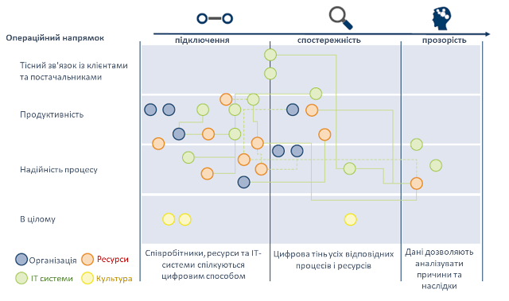

Рисунок 15: Ідентифікація заходів

The measures for both of the stages that must be completed in order to reach the target state – i.e. maturity stage consistency and attainment of a higher maturity stage – are first of all plotted along the time axis so that they can be prioritised, coordinated with each other and implemented in a logical sequence. 

Заходи для обох етапів, які мають бути виконані для досягнення цільового стану (тобто узгодженості етапу зрілості та досягнення вищого етапу зрілості) насамперед наносяться на осі часу, щоб їх можна було визначити за пріоритетністю, узгодити з кожним інші і впроваджувати в логічній послідовності.

Можливість оцінки користі від застосування заходів та їх вартості можна  провести за допомогою матриці "витрати-користь". Індикаторна система  використовується для оцінки користі, де кожній можливості присвоюється  відповідний індикатор. Покращення показників індикатора відображає  розвиток відповідної можливості, що дозволяє оцінити користь від певного заходу. Оцінку вартості залишається на розсуд кожної окремої компанії.

## Оцінювання переваг застосування

Для кількісного оцінювання переваг застосування концепції Індустрії 4.0 для підприємств використовуються покзаники (Індикатори). Основна ідея полягає в тому, щоб пов'язати встановлені на підприємстві показники з впливами Індустрії 4.0, щоб відображати результати в конкретних числах (див. рису. 16). Це дозволяє підприємствам зрозуміти, як покращення рівня зрілості  впливає на конкретні показники.

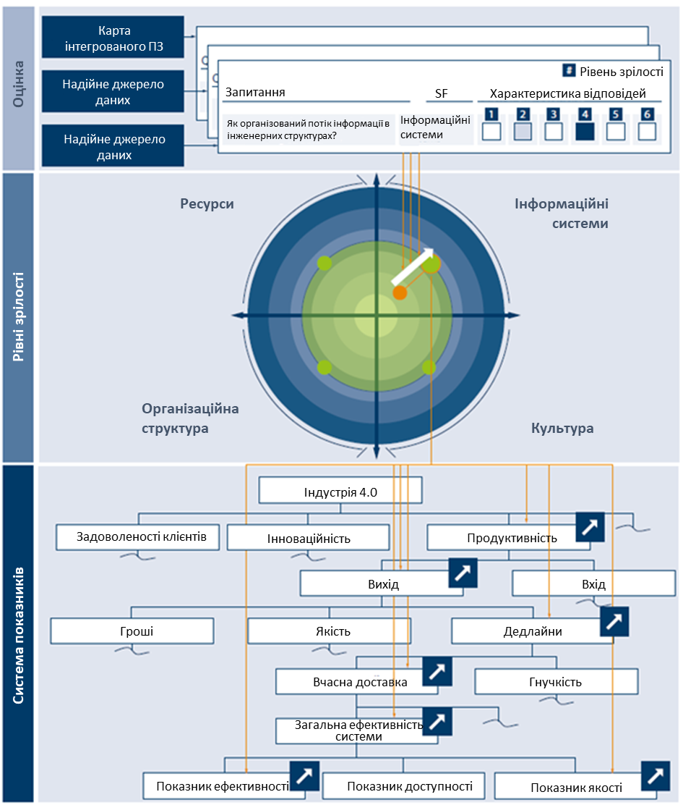

Рисунок 16: Зв’язок між схемою класифікації ключових показників та Індексом зрілості 

