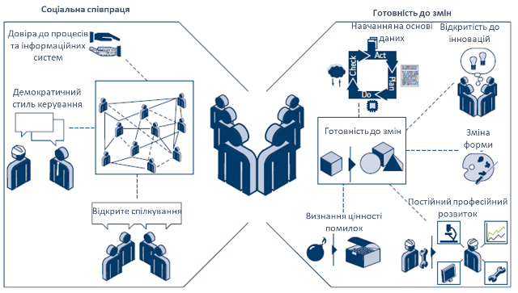

# Культура та організація виробництва - основа на шляху до Індустрії 5.0      

Олександр Пупена, [кафедра АКТСУ](https://www.iasu-nuft.pp.ua/), Національний університет харчових технологій

Працюючи над грантами в тему цифрових двійників я наткнувся на дуже цікавий посібник від Німецької національної академії науки та інженерії (Acatech) щодо оцінювання  готовності підприємств до Індустрії 4.0 ("Industrie 4.0 Maturity Index"). Посібник мене на стільки зачепив, що я вирішив його перекласти українською. По-перше, це допомогло максимально зосередитися на висвітлених методиках, по-друге, -  залучити до ознайомлення з ним якомога більше аудиторію. Сам переклад і лінк на оригінал доступні за [цим посиланням](https://pupenasan.github.io/dt/articles/MatInd_2020), тому Ви зможете за бажанням ознайомитися самостійно. Натомість в цій статті я хочу звернути увагу тільки на деякі моменти, які "тригернули" моє бажання максимально її розповсюдити.

Отже, перш за все, посібник більше відповідає темі Індустрії 5.0 аніж 4.0. Такі основні критерії оцінювання як "людино-центричність" і здатність адаптуватися мене найбільш вразили. Якщо до цього більшість матеріалу було направлено на технології, на здатність людей працювати з ними та максимально їх використовувати для досягнення персоналізованих побажань клієнтів, то цей посібник робив акцент на іншу надважливу частину виробництва. Цитата: "Індустрія 4.0 - це інтеграція інформаційних та комунікаційних технологій у промислове виробництво, що дозволяє підвищити ефективність процесів, процедур і систем та створити нові можливості для диференціації продуктів та послуг компаній. Проте, ***для використання всього потенціалу новітніх технологій недостатньо їх технічного впровадження, необхідна організаційна трансформація та культурна адаптація компаній***.  Кінцева мета — стати гнучкою компанією, що навчається, яка здатна постійно й динамічно адаптуватися до руйнівного середовища, зокрема, щоб краще долати несподівані події, такі як, наприклад криза, пов’язана з коронавірусом. " Далі весь зміст дослідження і рекомендації повністю відповідає змісту в даному абзаці. 

Згідно розробленої методики оцінка готовності підприємств проводиться в чотирьох структурних областях. Основна ідея використання методики - визначити теперішній статус кво підприємства, визначити бажану позицію, щоб перейти до неї шляхом покращення рівня зрілості в кожній із цих структурних областей. Нічого наче особливого, але погляньте на ці області:

- ресурси
- інформаційні системи
- організаційна структура
- культура

Рисунок 1. Індекс зрілості в контексті концепції «Фреймворку виробництва та керування»

Фактично тільки дві з цих областей стосуються безпосередньо використання технологій і їх доступність, інші дві - про людей та їх відношення в колективі. І як наголошується в цьому документі саме в цих областях є найбільші проблеми щодо готовності до Індустрії 4.0. Нижче коротко про кожну з них. 

У посібнику говориться, що гнучкість компанії сильно залежить від поведінки її співробітників. Досвід ощадливого менеджменту в 1990-х і 2000-х роках показав, що ключем до успішного впровадження ощадливого менеджменту в бізнесі є зміна **культури компанії**, іншими словами, зміна менталітету її співробітників. Те саме стосується цифрової трансформації в гнучку компанію, що навчається. Компанії не зможуть досягти бажаної гнучкості, якщо вони просто запровадять цифрові технології, не звертаючи уваги на свою корпоративну культуру. Натомість вони повинні почати з вирішення того, якою бачать компанію в майбутньому, і які навички знадобляться їхнім працівникам. Лише тоді вони повинні визначити та запровадити технології, необхідні для підтримки бажаного способу роботи. Необхідна трансформація корпоративної культури закладена в двох ключових принципах:  готовність до змін і соціальна співпраця. 

**Готовність до змін**. Ідеальний сценарій полягає в тому, щоб уся робоча сила була готова до змін. Крім того, ця готовність до змін не повинна обмежуватися ситуаціями, коли зміни вже впроваджуються. Люди повинні дивитися на своє власне оточення та корпоративне оточення відкритими очима, розпізнавати, коли є можливість або потреба для змін, і самостійно ініціювати відповідні дії. Бажання змінюватися є першим принципом культури та ключовим фактором спритності. Перший принцип структурної області «культура» базується на п’яти здібностях, які не слід розглядати окремо одна від одної, бо лише коли вони поєднуються, вони призводять до бажання змінюватися. 

**Соціальна співпраця**. Ідеальний сценарій полягає в тому, щоб працівники вірили, що їхні дії повинні повністю базуватися на знаннях. Термін «знання» охоплює будь-які знання, отримані шляхом цілеспрямованого спостереження, випадково, шляхом аналізу даних або практичного досвіду. Середовище, яке характеризується довірою та соціальними стосунками, створює основу для відкритого, вільного обміну знаннями між співробітниками. Отже, другий принцип культури, соціальна співпраця, допомагає прискорити обмін знаннями в компанії. 

Рисунок 2.  Характеристики, якими повинні володіти ресурси виробничої компанії після того, як вона досягла стадії зрілості «адаптивності». 

У той час як трансформація в гнучку компанію, що навчається, можлива завдяки технологіям, для її впровадження потрібна правильна **організаційна структура**. У наведеній моделі організаційна структура відноситься як до внутрішньої організації компанії (структура та операційні процеси), так і до її позиції в мережі доданої вартості. На відміну від структурної області «культури», «організаційна структура» встановлює обов’язкові правила, які організовують співпрацю як всередині компанії, так і за її межами. «Культура» охоплює систему цінностей всередині компанії і, таким чином, описує м’які фактори співпраці. Тим не менш, обидві структурні області взаємозалежні і повинні бути узгоджені одна з одною. Структурна область «організаційна структура» охоплена двома принципами: органічної внутрішньої організації та динамічної співпраці в рамках мережі цінностей. Тому вона описує організацію як з внутрішньої, так і з зовнішньої точки зору

**Органічна внутрішня організація**. Органічна організація є антиподом механістичної організації. Її співробітники мають менше обмежень і високу індивідуальну відповідальність. Таким чином, ця форма організації особливо добре підходить для організацій з висококваліфікованою робочою силою, яка існує в динамічному середовищі.

**Динамічне співробітництво в мережах вартості.** Автоматизований та безперебійний обмін інформацією між різними компаніями дозволяє їм співпрацювати більш динамічно та забезпечує підвищену прозорість щодо ринку. Це також допомагає зменшити деякі бар’єри на шляху до більшої гнучкості, такі як ручні процеси для запитів, замовлення та обробки замовлень. Операційну видимість можна розширити, включивши в неї статус виробництва постачальника та показники якості за допомогою сучасних технологій IoT. Результатом є більш ефективний обмін інформацією, товарами та послугами.

Рисунок 3. Характеристики, якими повинні володіти ресурси виробничої компанії після того, як вона досягла стадії зрілості «адаптивності». 

Я повністю погоджуюся з тим, що ніякі технології не можуть привести до успішності роботи компанії без зміни культури і організації виробництва. І це стосується всіх компаній, а не тільки виробничих. Я думаю навіть цих коротких витримок з тексту посібника достатньо щоб порівняти з існуючою картиною і оцінити глибину проблеми. Керівництву підприємств перш за все необхідно кардинально змінити "червону культуру". Тим не менше, це не змінить того факту, що необхідно змінюватися не тільки менеджменту компанії але і рядовим працівникам. А це на мою думку завдання набагато вищого порядку складності. Виходом з цієї ситуації може стати поява нових компаній, організованими людьми з цінностями 5.0. Однак при низькій культурі в суспільстві та й ще за умови вйни це є також нетривіальною задачею. Вочевидь це ітераційні і навіть рекусрсійні процеси, які треба намагатися запускати і підживлювати. Принаймні про це треба говорити, популяризувати, організовувати тренінги, максимально залучатися в європейські процеси.   

А як вважаєте Ви? Поговоримо про це на [конференції Індустрії 5.0](https://www.clusters.org.ua/industry-5-0-in-ukraine/).   

